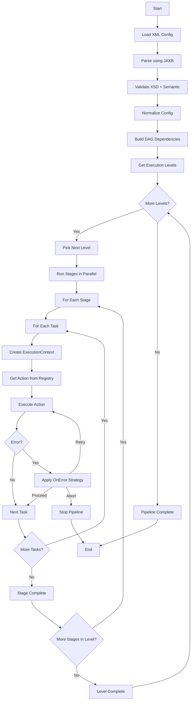
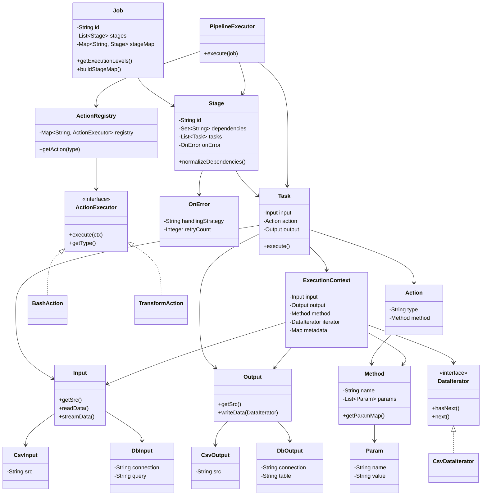

# Data Pipeline Framework

A lightweight **XML-driven data pipeline framework** written in Java.

The system parses pipeline definitions from XML, validates them against an XSD schema, builds a dependency graph of stages, and executes the pipeline in **topologically ordered stages**.

---
## Live Demo
Access the UI here:
https://data-pipeline-config.netlify.app/
---
# Features

- XML-based pipeline configuration
- XSD schema validation
- Semantic validation
- Dependency resolution between stages
- Topological execution order
- Modular architecture
- Extensible execution engine
- Memory-efficient streaming data processing via Iterators

---

# Project Architecture

The framework follows a layered processing pipeline:

```
XML Configuration
        ↓
XSD Validation
        ↓
JAXB Parsing
        ↓
Semantic Validation
        ↓
Configuration Normalization
        ↓   
Dependency Graph Construction
        ↓
Execution Engine (Action-driven)
```

---
# Data Model

## XML Schema (Tree Representation)
```
job (id)
└── stage* (id, pre_req?)
    ├── on_error? (handling_strategy, retry_count?)
    └── task+
        ├── input (csv | db)
        ├── action (type + method + params)
        └── output (csv | db)
```

## Java Object Model
```
Job
└── Stages
    └── Tasks
        ├── Input 
        ├── Action (type + method)
        └── Output 
```
---


# Pipeline Execution Flow

The following diagram shows the **complete lifecycle of a pipeline run**.



### Execution Steps

1. CLI starts the application
2. `Main.main()` receives the XML path
3. `Pipeline.run()` orchestrates execution
4. `JAXBPipelineParser` parses XML
5. XML validated against `job.xsd`
6. `Job` object graph is created
7. `SemanticValidator` validates pipeline semantics
8. `ConfigNormalizer` resolves dependencies
9. Dependency graph is built
10. Execution levels are computed
11. Pipeline structure is printed
12. `PipelineExecutor` runs stages level by level
13. Each task executes via ActionExecutor

---
## Validation Layers

### 1. XSD Validation (Structure)
- Required tags
- Attribute validation
- Correct XML structure

### 2. Semantic Validation (Logic)
- Unique stage IDs
- Valid dependencies
- Tasks must exist
- Input, Action, Output required
- Valid on_error strategy (retry, abort/stop, proceed/skip)

### 3. Runtime Validation
- Cycle detection during DAG construction

---
## DAG Execution Logic

The framework uses Kahn’s Algorithm (Topological Sort).

Algorithm:

1. Compute indegree of each stage
2. Add all stages with indegree = 0 to a queue
3. Process level by level
4. Reduce indegree of dependent stages
5. Add new zero-indegree stages to queue
6. If processed nodes are not equal to total nodes, a cycle exists
---
## Execution Model
### Core Idea
```declarative
Input  → Data source (Streamed via Iterators)
Action → Logic to execute (Lazy execution)
Method → Configuration of logic
Output → Destination (Written incrementally)
```

### Execution Flow
- Task creates an ExecutionContext
- ActionRegistry resolves the correct executor
- ActionExecutor executes using context
- Data streams through executors via Iterators to minimize memory consumption
- Metadata (e.g., stageId) flows through execution

### ExecutionContext

Runtime object that carries:

- Input
- Output
- Method configuration
- DataIterator (for streaming records)
- Metadata (e.g., stageId)

### ActionExecutor Interface

Each action implements:

- execute(ExecutionContext ctx)
- getType()

### ActionRegistry
- Maps action types → executors
- Supports plug-and-play extensibility
### Supported Actions
1. Transformation Actions (In-Memory / Streaming Data Transformations):
    - **filter**: Filters rows based on a condition (params: `column`, `operator`, `value`).
    - **select**: Keeps only specified columns (params: `columns`).
    - **map**: Modifies a column's value (params: `column`, `operation`, `value`). Operations: `add`, `multiply`.
    - **aggregate**: Groups data and performs an aggregation (params: `group_by`, `column`, `operation`). Operations: `avg`, `max`, `count`.
2. Bash Action
- Supports execution of external shell scripts in a configuration-driven way.
- Key Design:
  - Script defined via method params (NOT input).
  - Additional arguments can be passed via `arg1`, `arg2`, etc.
  - Framework executes the script as: `bash <script> <input_data> <arg1>... <output_data>`
  - Input = data target
  - Action = execution logic
  - Method params = configuration
---
## Key Interactions
````
CLI → Main → Pipeline

Pipeline → Parser
Parser → XML Schema Validation
Parser → Job Object

Pipeline → SemanticValidator
Pipeline → ConfigNormalizer

Pipeline → PipelineExecutor

PipelineExecutor → Job.getExecutionLevels()
PipelineExecutor → Stage execution

Stage → Task execution
````

---

## UML Class Diagram

The class diagram shows the **core object model of the pipeline system**.



---

## Core Components

### Main
- Entry point
- Handles CLI input and exceptions

### Pipeline
- Orchestrates execution
- Flow: parse -> validate -> normalize -> execute

### Job
- Root pipeline object
- Maintains stages and stage map
- Builds DAG and execution levels

### Stage
- Represents a DAG node
- Contains tasks, dependencies, and error handling configuration

### Task
- Execution unit consisting of input, action, and output

### JAXBPipelineParser
- Converts XML to object graph
- Applies XSD validation

### SemanticValidator
- Ensures logical correctness of pipeline

### ConfigNormalizer
- Resolves dependencies and prepares configuration

### PipelineExecutor
- Executes pipeline stage by stage

---

# Project Structure
````
data-pipeline-framework/
│
├── src/main/java/org/example/datapipeline/
│
│   ├── cli/
│   │   └── Pipeline.java
│
│   ├── config/
│   │   ├── Job.java
│   │   ├── Stage.java
│   │   ├── Task.java
│   │   ├── action/
│   │   │   ├── Action.java
│   │   │   ├── Method.java
│   │   │   └── Param.java
│   │   ├── input/
│   │   │   ├── Input.java
│   │   │   ├── CsvInput.java
│   │   │   └── DbInput.java
│   │   ├── output/
│   │   │   ├── Output.java
│   │   │   ├── CsvOutput.java
│   │   │   └── DbOutput.java
│
│   ├── executor/
│   │   ├── PipelineExecutor.java
│   │   ├── action/
│   │   │   ├── ActionExecutor.java
│   │   │   ├── ActionRegistry.java
│   │   │   ├── BashAction.java
│   │   │   └── transform/
│   │   │       ├── AggregateTransform.java
│   │   │       ├── FilterTransform.java
│   │   │       ├── MapTransform.java
│   │   │       ├── SelectTransform.java
│   │   │       ├── TransformAction.java
│   │   │       └── TransformMethod.java
│   │   ├── context/
│   │   │   └── ExecutionContext.java
│   │   └── iterator/
│   │       ├── CsvDataIterator.java
│   │       └── DataIterator.java
│
│   ├── parser/
│   │   └── JAXBPipelineParser.java
│
│   ├── validator/
│   │   └── SemanticValidator.java
│
│   ├── util/
│   │   └── ConfigNormalizer.java
│
│   └── Main.java
│
├── src/main/resources/
│   ├── schema/
│   │   ├── job.xsd
│   │   └── superiorjob.xsd
│   │
│   ├── pipeline_config/
│   │   ├── pipeline_instance.xml
│   │   └── pipeline_script.xml
│   │
│   ├── scripts/
│   │   ├── test.sh
│   │   └── enrich.sh
│   │
│   ├── input/
│   │   └── *.csv
│   │
│   └── output/
│
├── ui/
│   └── index.html
│
├── images/
├── pom.xml
└── README.md

````


---

## Testing

Covered scenarios:

### Valid Pipelines
- Simple
- Parallel
- Diamond DAG
- Fanout
- Large scale pipelines

### Invalid Pipelines
- Cycles
- Duplicate stages
- Missing dependencies
- Invalid configurations

### Additional
- CLI execution
- DAG correctness

---

## How to Run
```bash
mmvn clean install
java -cp target/classes org.example.datapipeline.Main src/main/resources/pipeline_config/pipeline_instance.xml
```

---

[//]: # (## Advanced XSD Schema Design &#40;v2&#41;)

[//]: # ()
[//]: # (To create a highly extensible, deeply validated pipeline framework, we entirely redesigned the `job.xsd` schema into `superiorjob.xsd`.)

[//]: # ()
[//]: # (### Schema Architecture Diagram)

[//]: # ()
[//]: # (```mermaid)

[//]: # (classDiagram)

[//]: # (    direction TB)

[//]: # ()
[//]: # (    class JobType {)

[//]: # (        +xs:token id)

[//]: # (        +StageType[] stage)

[//]: # (    })

[//]: # ()
[//]: # (    class StageType {)

[//]: # (        +xs:ID id)

[//]: # (        +xs:IDREFS pre_req)

[//]: # (        +OnErrorType on_error)

[//]: # (        +TaskType[] task)

[//]: # (    })

[//]: # ()
[//]: # (    class TaskType {)

[//]: # (        +InputType input)

[//]: # (        +ActionType action)

[//]: # (        +OutputType output)

[//]: # (    })

[//]: # ()
[//]: # (    class InputType {)

[//]: # (        <<xs:choice>>)

[//]: # (        +CsvType csv)

[//]: # (        +FutureInputs...)

[//]: # (    })

[//]: # ()
[//]: # (    class ActionType {)

[//]: # (        <<xs:choice>>)

[//]: # (        +FilterRowActionType filterRow)

[//]: # (        +FutureActions...)

[//]: # (    })

[//]: # ()
[//]: # (    class OutputType {)

[//]: # (        <<xs:choice>>)

[//]: # (        +CsvType csv)

[//]: # (        +FutureOutputs...)

[//]: # (    })

[//]: # ()
[//]: # (    JobType "1" --> "1..*" StageType : contains)

[//]: # (    StageType "1" --> "1..*" TaskType : contains)

[//]: # (    TaskType "1" --> "1" InputType : uses)

[//]: # (    TaskType "1" --> "1" ActionType : uses)

[//]: # (    TaskType "1" --> "1" OutputType : uses)

[//]: # (```)

[//]: # ()
[//]: # (### Core Design Decisions & Justifications)

[//]: # ()
[//]: # (1. **Venetian Blind Pattern &#40;Modularity&#41;**)

[//]: # (Instead of deeply nesting "Russian Doll" inline structures, the schema defines global `<xs:complexType>` building blocks &#40;e.g., `JobType`, `StageType`&#41;. This keeps the schema incredibly readable and allows massive pipeline enterprise architectures to reuse these foundational domain types if imported.)

[//]: # ()
[//]: # (2. **Polymorphic I/O & Actions &#40;`<xs:choice>`&#41;**)

[//]: # (Instead of defining a single generic `<input type="csv">` tag loaded with dozens of optional attributes, we enforce **Polymorphic Elements** &#40;e.g., `<input><csv src="..."/></input>`&#41;. This acts as an explicit schema `switch` statement.)

[//]: # (   - **Justification:** It prevents users from writing illegal attribute combinations, and it seamlessly wires into Java `JAXB`. JAXB automatically generates an abstract `Input` base class with concrete `CsvInput` subclasses so the Java layer doesn't need giant, unmaintainable if-else action routers.)

[//]: # ()
[//]: # (3. **Strict Type Safety over Raw Strings**)

[//]: # (Instead of allowing whitespace-heavy raw `xs:string` values, the schema enforces:)

[//]: # (   - `NonEmptyString` &#40;`minLength=1` on `xs:token`&#41; to prevent accidently supplying `<job id=" ">`)

[//]: # (   - `xs:nonNegativeInteger` for `retry_count` so users cannot retry a pipeline `-5` times)

[//]: # (   - `HandlingStrategyEnum` so the `on_error` strategy only accepts exact backend-supported behaviors &#40;`STOP`, `SKIP`, `RETRY`&#41;, instantly intercepting typos at parse-time.)