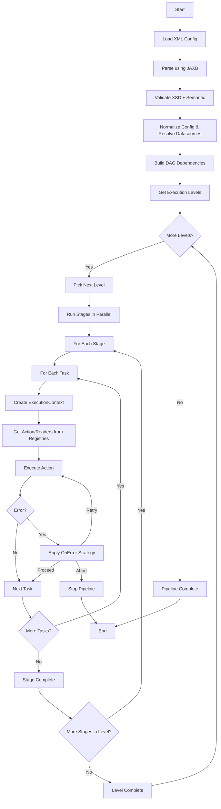
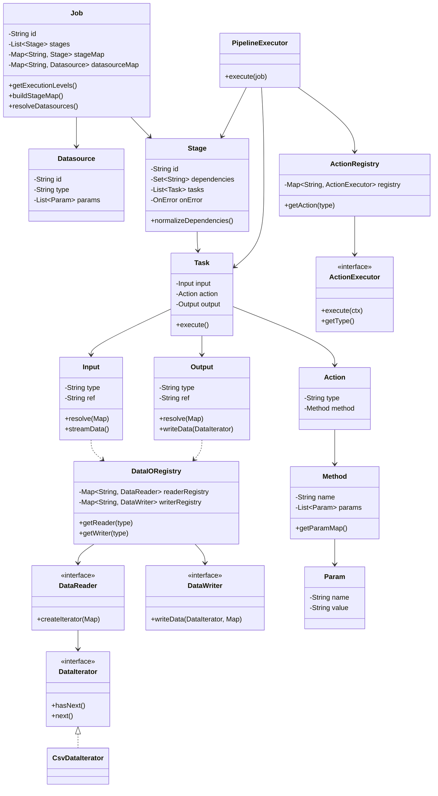

# Data Pipeline Framework

A lightweight **XML-driven data pipeline framework** written in Java.

The system parses pipeline definitions from XML, validates them against an XSD schema, builds a dependency graph of stages, and executes the pipeline in **topologically ordered stages**.

---
## Live Demo
Access the UI here:
https://data-pipeline-config.netlify.app/
---
# Features

- **Hybrid XML Configuration**: Supports defining both global reusable datasources and one-off inline parameters.
- **SOLID Architecture**: Highly extensible Action, Input, and Output registries following the Open-Closed Principle.
- **XSD schema validation** & Semantic validation
- Dependency resolution between stages & Topological execution order
- Memory-efficient streaming execution using custom iterators (DataIterator)
  - Processes data row-by-row (lazy evaluation)
  - Avoids loading entire datasets into memory

---

# Project Architecture

The framework follows a layered processing pipeline:

```
XML Configuration
        ↓
XSD Validation
        ↓
JAXB Parsing
        ↓
Semantic Validation
        ↓
Configuration Normalization
        ↓   
Dependency Graph Construction
        ↓
Execution Engine (Action/IO Registries)
```

---
# Data Model

## XML Schema (Tree Representation)
```
job (id)
├── datasources?
│   └── datasource* (id, type)
│       └── param* (name, value)
└── stage* (id, pre_req?)
    ├── on_error? (handling_strategy, retry_count?)
    └── task+
        ├── input (type?, ref?)
        │     └── param* (name, value)
        ├── action (type)
        │     └── method (name)
        │           └── param* (name, value)
        └── output (type?, ref?)
              └── param* (name, value)
```

## Java Object Model
```
Job
├── Datasource
└── Stage
    └── Task
        ├── Input
        ├── Action
        │     └── Method
        │           └── Param*
        └── Output
```

---

# Pipeline Execution Flow

The following diagram shows the **complete lifecycle of a pipeline run**.


```mermaid
flowchart TD

A[Start]
B[Load XML Config]
C[Parse using JAXB]
D[Validate XSD + Semantic]
E[Normalize Config & Resolve Datasources]
F[Build DAG Dependencies]
G[Get Execution Levels]
H{More Levels?}
I[Pick Next Level]
J[Run Stages in Parallel]
K[For Each Stage]
L[For Each Task]
M[Create ExecutionContext]
N[Get Action/Readers from Registries]
O[Execute Action]
P{Error?}
Q[Next Task]
R[Apply OnError Strategy]
S{More Tasks?}
T[Stage Complete]
U{More Stages in Level?}
V[Level Complete]
W[Pipeline Complete]
X[End]
Z[Stop Pipeline]

A --> B --> C --> D --> E --> F --> G --> H
H -->|Yes| I --> J --> K --> L --> M --> N --> O --> P
P -->|No| Q
P -->|Yes| R
R -->|Retry| O
R -->|Proceed| Q
R -->|Abort| Z
Q --> S
S -->|Yes| L
S -->|No| T
T --> U
U -->|Yes| K
U -->|No| V
V --> H
H -->|No| W --> X
Z --> X
```

---
## Validation Layers

### 1. XSD Validation (Structure)
- Required tags & Attribute validation

### 2. Semantic Validation (Logic)
- Unique stage IDs & Valid dependencies
- Input, Action, Output configurations properly resolved

### 3. Runtime Validation
- Cycle detection during DAG construction

---
## DAG Execution Logic

The framework uses Kahn’s Algorithm (Topological Sort).

---
## Execution Model
### Core Idea
```declarative
Global Datasource → Looked up by 'ref' OR
Inline Params     → Defined in 'input'
Input  → Resolved to DataReader (Streamed via Iterators)
Action → Logic to execute (Lazy execution)
Method → Configuration of logic
Output → Destination via DataWriter (Written incrementally)
```

### ActionExecutor Interface
Each action implements:
- `void execute(ExecutionContext ctx)`
- `String getType()`

### ActionRegistry & DataIORegistry
- Maps action/IO types → executors/handlers entirely avoiding hardcoded schema coupling.
- Supports pure **plug-and-play extensibility (OCP compliant)**.

---

## UML Class Diagram

The class diagram shows the **core object model of the pipeline system**.


```mermaid
classDiagram

class Job {
  -String id
  -List~Stage~ stages
  -Map~String, Stage~ stageMap
  -Map~String, Datasource~ datasourceMap
  +getExecutionLevels()
  +buildStageMap()
  +resolveDatasources()
}

class Datasource {
  -String id
  -String type
  -List~Param~ params
}

class Stage {
  -String id
  -Set~String~ dependencies
  -List~Task~ tasks
  -OnError onError
  +normalizeDependencies()
}

class Task {
  -Input input
  -Action action
  -Output output
  +execute()
}

class Input {
  -String type
  -String ref
  +resolve(Map)
  +streamData()
}

class Output {
  -String type
  -String ref
  +resolve(Map)
  +writeData(DataIterator)
}

class DataReader {
  <<interface>>
  +createIterator(Map)
}

class DataWriter {
  <<interface>>
  +writeData(DataIterator, Map)
}

class DataIORegistry {
  -Map~String, DataReader~ readerRegistry
  -Map~String, DataWriter~ writerRegistry
  +getReader(type)
  +getWriter(type)
}

class DataIterator {
  <<interface>>
  +hasNext()
  +next()
}
class CsvDataIterator {
}
DataIterator <|.. CsvDataIterator

class Action {
  -String type
  -Method method
}

class Method {
  -String name
  -List~Param~ params
  +getParamMap()
}

class Param {
  -String name
  -String value
}

class ActionExecutor {
  <<interface>>
  +execute(ctx)
  +getType()
}

class ActionRegistry {
  -Map~String, ActionExecutor~ registry
  +getAction(type)
}

class PipelineExecutor {
  +execute(job)
}

%% Relationships
Job --> Stage
Job --> Datasource
Stage --> Task
Task --> Input
Task --> Output
Task --> Action

Input ..> DataIORegistry
Output ..> DataIORegistry
DataIORegistry --> DataReader
DataIORegistry --> DataWriter
DataReader --> DataIterator

Action --> Method
Method --> Param

ActionRegistry --> ActionExecutor
PipelineExecutor --> Stage
PipelineExecutor --> Task
PipelineExecutor --> ActionRegistry
```

---

## How to Run
```bash
mvn clean install

java -cp target/classes \
org.example.datapipeline.Main \
src/main/resources/pipeline_config/pipeline_etl.xml
```