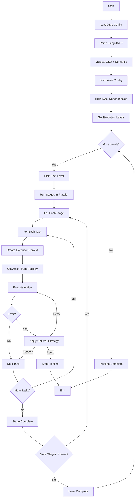
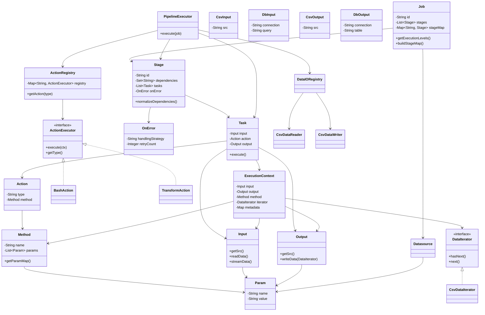

# Data Pipeline Framework

A lightweight **XML-driven data pipeline framework** written in Java.

The system parses pipeline definitions from XML, validates them against an XSD schema, builds a dependency graph of stages, and executes the pipeline in **topologically ordered stages**.

---
## Live Demo
Access the UI here:
https://data-pipeline-config.netlify.app/
---
# Features

- XML-based pipeline configuration
- XSD schema validation
- Semantic validation
- Dependency resolution between stages
- Topological execution order
- Modular architecture
- Extensible execution engine
- Memory-efficient streaming execution using custom iterators (DataIterator)
  - Processes data row-by-row (lazy evaluation)
  - Avoids loading entire datasets into memory
  - Enables scalable processing of large files

---

# Project Architecture

The framework follows a layered processing pipeline:

```
XML Configuration
        ↓
XSD Validation
        ↓
JAXB Parsing
        ↓
Semantic Validation
        ↓
Configuration Normalization
        ↓   
Dependency Graph Construction
        ↓
Execution Engine (Action-driven)
```

---
# Data Model

## XML Schema (Tree Representation)
```
job (id)
├── datasources?
│   └── datasource* (id, type)
│         └── param* (name, value)
└── stage* (id, pre_req?)
    ├── on_error? (handling_strategy, retry_count?)
    └── task+
        ├── input (type?, ref?)
        │     └── param* (name, value)
        ├── action (type)
        │     └── method (name)
        │           └── param* (name, value)
        └── output (type?, ref?)
              └── param* (name, value)
```

## Java Object Model
```
Job
├── Datasource*
└── Stage
    └── Task
        ├── Input (Map<String, String> resolvedParams)
        ├── Action
        │     └── Method
        │           └── Param*
        └── Output (Map<String, String> resolvedParams)
```
---


# Pipeline Execution Flow

The following diagram shows the **complete lifecycle of a pipeline run**.


```mermaid
flowchart TD

A[Start]
B[Load XML Config]
C[Parse using JAXB]
D[Validate XSD + Semantic]
E[Normalize Config]
F[Build DAG Dependencies]
G[Get Execution Levels]
H{More Levels?}
I[Pick Next Level]
J[Run Stages in Parallel]
K[For Each Stage]
L[For Each Task]
M[Create ExecutionContext]
N[Get Action from Registry]
O[Execute Action]
P{Error?}
Q[Next Task]
R[Apply OnError Strategy]
S{More Tasks?}
T[Stage Complete]
U{More Stages in Level?}
V[Level Complete]
W[Pipeline Complete]
X[End]
Z[Stop Pipeline]

A --> B --> C --> D --> E --> F --> G --> H
H -->|Yes| I --> J --> K --> L --> M --> N --> O --> P
P -->|No| Q
P -->|Yes| R
R -->|Retry| O
R -->|Proceed| Q
R -->|Abort| Z
Q --> S
S -->|Yes| L
S -->|No| T
T --> U
U -->|Yes| K
U -->|No| V
V --> H
H -->|No| W --> X
Z --> X

```

### Execution Steps

1. CLI starts the application
2. `Main.main()` receives the XML path
3. `Pipeline.run()` orchestrates execution
4. `JAXBPipelineParser` parses XML
5. XML validated against `job.xsd`
6. `Job` object graph is created
7. `SemanticValidator` validates pipeline semantics
8. `ConfigNormalizer` resolves dependencies
9. Dependency graph is built
10. Execution levels are computed
11. Pipeline structure is printed
12. `PipelineExecutor` runs stages level by level
13. Each task executes via ActionExecutor

---
## Validation Layers

### 1. XSD Validation (Structure)
- Required tags
- Attribute validation
- Correct XML structure

### 2. Semantic Validation (Logic)
- Unique stage IDs
- Valid dependencies
- Tasks must exist
- Input, Action, Output required
- Valid on_error strategy (retry, abort/stop, proceed/skip)

### 3. Runtime Validation
- Cycle detection during DAG construction

---
## DAG Execution Logic

The framework uses Kahn’s Algorithm (Topological Sort).

Algorithm:

1. Compute indegree of each stage
2. Add all stages with indegree = 0 to a queue
3. Process level by level
4. Reduce indegree of dependent stages
5. Add new zero-indegree stages to queue
6. If processed nodes are not equal to total nodes, a cycle exists
---
## Execution Model
### Core Idea
```declarative
Global Datasource → Centralized logic to reuse external connections
Input  → Data source (Streamed via Iterators mapping dynamically from params)
Action → Logic to execute (Lazy execution)
Method → Configuration of logic
Output → Destination (Written incrementally matching dynamic registry)
```

### Execution Flow
- Global parameters are injected into tasks based on `ref` tags
- Input is converted to a DataIterator via `DataIORegistry`
- ExecutionContext is created
- ActionRegistry resolves executor
- Action processes the iterator
- Output is written incrementally via `DataIORegistry`

### ExecutionContext

Runtime object that carries:

- Input
- Output
- Method configuration
- DataIterator (stream)
- Metadata (e.g., stageId)

### Registry Architectures (100% OCP Compliant)

Our engine strictly follows the Open-Closed Principle for extending integrations.
Core logic is sealed, while extending is simply executing `.register()`:

- **ActionRegistry**: Maps action types (like `"transform"`) to `ActionExecutors`.
- **DataIORegistry**: Maps file types (like `"csv"`) to `DataReaders` and `DataWriters`.

### Supported Actions
1. Transform:
    - **filter**: Filters rows based on a condition (params: `column`, `operator`, `value`).
    - **select**: Keeps only specified columns (params: `columns`).
    - **map**: Modifies a column's value (params: `column`, `operation`, `value`). Operations: `add`, `multiply`.
    - **aggregate**: Groups data and performs an aggregation (params: `group_by`, `column`, `operation`). Operations: `avg`, `max`, `count`.
2. Bash Action
- Supports execution of external shell scripts in a configuration-driven way.
- Key Design:
  - Script defined via method params (NOT input).
  - Additional arguments can be passed via `arg1`, `arg2`, etc.
  - Framework executes the script as: `bash <script> <input_data> <arg1>... <output_data>`
  - Input = data target
  - Action = execution logic
  - Method params = configuration
  
---
###  Execution Engine
```java
levels.get(level)
    .parallelStream()
    .forEach(PipelineExecutor::executeStage);
```
- Parallel within level
- Sequential across levels
---

## Sequence Diagram
````mermaid
sequenceDiagram

participant CLI
participant Main
participant Pipeline
participant Parser as JAXBPipelineParser
participant Validator as SemanticValidator
participant Normalizer as ConfigNormalizer
participant Executor as PipelineExecutor
participant Job
participant Stage
participant Task

CLI ->> Main: start application
Main ->> Pipeline: run(xmlPath)

Pipeline ->> Parser: parse(xml)
Parser ->> Parser: validate XSD
Parser -->> Pipeline: Job object

Pipeline ->> Validator: validate(job)
Pipeline ->> Normalizer: normalize(job)

Pipeline ->> Executor: execute(job)

Executor ->> Job: getExecutionLevels()

loop For each level
    Executor ->> Stage: executeStage()

    loop For each task
        Stage ->> Task: execute()
        Task ->> Task: resolve ActionExecutor
        Task ->> Task: process via ExecutionContext
    end
end

Executor -->> Pipeline: execution complete
Pipeline -->> Main: done
Main -->> CLI: exit

````

---

## UML Class Diagram

The class diagram shows the **core object model of the pipeline system**.


```mermaid
classDiagram

class Job {
  -String id
  -List~Stage~ stages
  -Map~String, Stage~ stageMap
  +getExecutionLevels()
  +buildStageMap()
}

class Stage {
  -String id
  -Set~String~ dependencies
  -List~Task~ tasks
  -OnError onError
  +normalizeDependencies()
}

class Task {
  -Input input
  -Action action
  -Output output
  +execute()
}

class Input {
  +getSrc()
  +readData()
  +streamData()
}
class CsvInput {
  -String src
}
class DbInput {
  -String connection
  -String query
}

class Output {
  +getSrc()
  +writeData(DataIterator)
}
class CsvOutput {
  -String src
}
class DbOutput {
  -String connection
  -String table
}

class DataIterator {
  <<interface>>
  +hasNext()
  +next()
}
class CsvDataIterator {
}
DataIterator <|.. CsvDataIterator

class Action {
  -String type
  -Method method
}

class Method {
  -String name
  -List~Param~ params
  +getParamMap()
}

class Param {
  -String name
  -String value
}

class OnError {
  -String handlingStrategy
  -Integer retryCount
}

class ActionExecutor {
  <<interface>>
  +execute(ctx)
  +getType()
}

class BashAction
class TransformAction

class ActionRegistry {
  -Map~String, ActionExecutor~ registry
  +getAction(type)
}

class PipelineExecutor {
  +execute(job)
}

class ExecutionContext {
  -Input input
  -Output output
  -Method method
  -DataIterator iterator
  -Map metadata
}

%% Relationships
Job --> Stage
Job --> Datasource
Stage --> Task
Stage --> OnError
Task --> Input
Task --> Output
Task --> Action

Action --> Method
Method --> Param
Input --> Param
Output --> Param
Datasource --> Param

Task --> ExecutionContext
ExecutionContext --> Method
ExecutionContext --> Input
ExecutionContext --> Output
ExecutionContext --> DataIterator

ActionExecutor <|.. BashAction
ActionExecutor <|.. TransformAction

ActionRegistry --> ActionExecutor
DataIORegistry --> CsvDataReader
DataIORegistry --> CsvDataWriter
PipelineExecutor --> Stage
PipelineExecutor --> Task
PipelineExecutor --> ActionRegistry
PipelineExecutor --> DataIORegistry
```

---

## Core Components

### Main
- Entry point
- Handles CLI input and exceptions

### Pipeline
- Orchestrates execution
- Flow: parse -> validate -> normalize -> execute

### Job
- Root pipeline object
- Maintains stages and stage map
- Builds DAG and execution levels

### Stage
- Represents a DAG node
- Contains tasks, dependencies, and error handling configuration

### Task
- Execution unit consisting of input, action, and output

### JAXBPipelineParser
- Converts XML to object graph
- Applies XSD validation

### SemanticValidator
- Ensures logical correctness of pipeline

### ConfigNormalizer
- Resolves dependencies and prepares configuration

### PipelineExecutor
- Executes pipeline stage by stage

---

# Project Structure
````
data-pipeline-framework/
│
├── src/main/java/org/example/datapipeline/
│
│   ├── cli/
│   │   └── Pipeline.java
│
│   ├── config/
│   │   ├── Job.java
│   │   ├── Stage.java
│   │   ├── Task.java
│   │   ├── action/
│   │   │   ├── Action.java
│   │   │   ├── Method.java
│   │   │   └── Param.java
│   │   ├── input/
│   │   │   ├── Input.java
│   │   │   ├── CsvInput.java
│   │   │   └── DbInput.java
│   │   ├── output/
│   │   │   ├── Output.java
│   │   │   ├── CsvOutput.java
│   │   │   └── DbOutput.java
│
│   ├── executor/
│   │   ├── PipelineExecutor.java
│   │   ├── action/
│   │   │   ├── ActionExecutor.java
│   │   │   ├── ActionRegistry.java
│   │   │   ├── BashAction.java
│   │   │   └── transform/
│   │   │       ├── AggregateTransform.java
│   │   │       ├── FilterTransform.java
│   │   │       ├── MapTransform.java
│   │   │       ├── SelectTransform.java
│   │   │       ├── TransformAction.java
│   │   │       └── TransformMethod.java
│   │   ├── context/
│   │   │   └── ExecutionContext.java
│   │   └── iterator/
│   │       ├── CsvDataIterator.java
│   │       └── DataIterator.java
│
│   ├── parser/
│   │   └── JAXBPipelineParser.java
│
│   ├── validator/
│   │   └── SemanticValidator.java
│
│   ├── util/
│   │   └── ConfigNormalizer.java
│
│   └── Main.java
│
├── src/main/resources/
│   ├── schema/
│   │   ├── job.xsd
│   │   └── superiorjob.xsd
│   │
│   ├── pipeline_config/
│   │   ├── pipeline_instance.xml
│   │   └── pipeline_script.xml
│   │
│   ├── scripts/
│   │   ├── test.sh
│   │   └── enrich.sh
│   │
│   ├── input/
│   │   └── *.csv
│   │
│   └── output/
│
├── ui/
│   └── index.html
│
├── pom.xml
└── README.md

````


---

## Testing

Covered scenarios:

### Valid Pipelines
- Simple
- Parallel
- Diamond DAG
- Fanout
- Large scale pipelines

### Invalid Pipelines
- Cycles
- Duplicate stages
- Missing dependencies
- Invalid configurations

### Additional
- CLI execution
- DAG correctness

---

## How to Run
```bash
mvn clean install

java -cp target/classes \
org.example.datapipeline.Main \
src/main/resources/pipeline_config/pipeline_etl.xml
```

---
