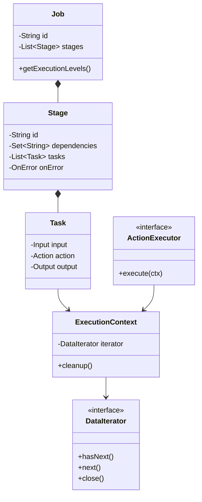
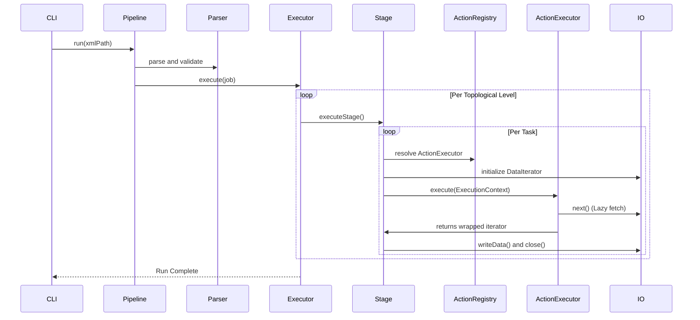

# Data Pipeline Framework

## 1. Introduction

The Data Pipeline Framework is a lightweight, production-grade **XML-driven ETL (Extract, Transform, Load) engine** written in Java. 

The core idea is to separate the configuration of data pipelines from their execution logic. Users define data flows using a declarative XML DSL (Domain Specific Language), while the underlying Java engine dynamically builds a Directed Acyclic Graph (DAG) and executes it using highly optimized, memory-efficient streams.

It exists to provide a scalable, single-node batch processing system that can handle massive datasets on commodity hardware by strictly enforcing a one-pass, streaming evaluation model, avoiding the overhead of heavy distributed systems like Apache Spark for simpler ETL jobs.

**Live UI Demo**: [https://data-pipeline-config.netlify.app/](https://data-pipeline-config.netlify.app/)

---

## 2. Key Features

- **XML-Based Declarative Configuration**: Define complex pipelines without writing Java code.
- **Strict Validation Pipelines**: Guarantees configuration safety via both XSD schema validation and semantic logic validation.
- **DAG-Based Execution**: Automatically resolves dependencies between stages and computes topological execution orders.
- **True Streaming Execution**: Processes data row-by-row (lazy evaluation) utilizing custom `DataIterator` interfaces, allowing gigabyte-scale processing without running out of heap memory.
- **Extensibility via Registries**: Fully adheres to the Open-Closed Principle (OCP). New file formats or transformation logic can be added instantly via `ActionRegistry` and `DataIORegistry`.
- **Production-Ready Run Tracking**: Fully integrated pipeline versioning and snapshot replays for data lineage and auditing.

---

## 3. Architecture 

The framework is built on a cleanly separated layered architecture.

### Layered Architecture

1. **XML Config (DSL)**: The entry point. A domain-specific XML file representing the execution job, global datasources, stages, and tasks.
2. **XSD Validation**: Validates the structural integrity of the XML tags and attributes before parsing begins.
3. **JAXB Parsing**: Deserializes the validated XML into strongly-typed Java Object Models (e.g., `Job`, `Stage`, `Task`).
4. **Semantic Validation**: Enforces business logic (e.g., preventing duplicate stage IDs, ensuring referenced datasources exist, validating `on_error` strategies).
5. **Normalization**: Resolves and injects global datasource parameters into individual task scopes.
6. **DAG Construction**: Generates a Directed Acyclic Graph from stage dependencies and detects circular loops.
7. **Execution Engine**: Executes the DAG level-by-level, instantiating iterators and executing tasks.

### Architectural Highlights

- **Iterator-Based Streaming Model**: Memory is bounded to single-row footprints. Disk-backed operations are only utilized when strictly necessary (e.g., external sorting).
- **Open-Closed Principle**: The execution engine is completely agnostic to the underlying implementations of `Action` and `IO`. 
- **Separation of Concerns**: Parsing, validation, orchestration, and execution are fully isolated components.

---

## 4. Data Model

### XML Schema (Tree Representation)
```text
job (id)
├── datasources?
│   └── datasource* (id, type)
│         └── param* (name, value)
└── stage* (id, pre_req?)
    ├── on_error? (handling_strategy, retry_count?)
    └── task+
        ├── input (type?, ref?)
        │     └── param* (name, value)
        ├── action (type)
        │     └── method (name)
        │           └── param* (name, value)
        └── output (type?, ref?)
              └── param* (name, value)
```

### Java Object Model
The core Java object mappings closely mirror the XML:
- **Job**: The root orchestrator holding the full stage graph and global configurations.
- **Stage**: A node in the DAG. It manages execution retries and houses a sequence of Tasks.
- **Task**: The smallest executable unit containing exactly one `Input`, one `Action`, and one `Output`.
- **Input / Output**: Configurations that get resolved via `DataIORegistry` into actual Data Readers/Writers.
- **Action / Method**: Defines *what* processing logic to apply and *how* to configure it.

---

## 5. Execution Deep Dive

### DAG Construction (Kahn’s Algorithm)
Execution order is determined dynamically using Kahn’s Algorithm for topological sorting. The framework calculates the indegree (number of dependencies) for every stage. Stages with 0 indegree are assigned to Level 0. Those dependencies are "resolved", unlocking the next level, iteratively building a multi-level execution queue. Leftover stages with non-zero indegrees instantly trigger cycle-detection exceptions.

### Stage-Level Parallelism
All stages within the same topological level are inherently independent. The `PipelineExecutor` uses Java's `parallelStream()` to execute these stages concurrently, maximizing CPU throughput.

### Task Execution Lifecycle & `ExecutionContext`
Inside a stage, `Task`s run sequentially. A task initializes an `ExecutionContext` which acts as the data payload.
1. `Input` creates a `DataIterator`.
2. The context is passed to the `ActionExecutor`.
3. The action consumes the iterator lazily, applying transformations, and overwrites the context with a *new* result iterator.
4. `Output` pulls from the modified iterator and writes to the destination.

### Iterator Flow
The system acts as a pipeline of pipes:
`Input File → DataIterator (Source) → ActionExecutor (Transformation Wrapper) → DataIterator (Modified) → Output File`

---

## 6. UML Diagrams

### Use Case Diagram
*Shows the primary interactions between the end-user and the framework.*
```mermaid
usecaseDiagram
    actor User
    
    package "Data Pipeline Framework" {
        usecase "Run Pipeline XML" as UC1
        usecase "Validate Configuration" as UC2
        usecase "Execute Stages/Tasks" as UC3
        usecase "Handle Errors & Retries" as UC4
        usecase "Replay Historical Run" as UC5
    }
    
    User --> UC1
    User --> UC5
    UC1 ..> UC2 : includes
    UC1 ..> UC3 : includes
    UC3 ..> UC4 : extends
```

### Class Diagram
*Shows the structural relationship between the orchestration layer, registries, and execution objects.*

```mermaid
classDiagram
class Job {
  -String id
  -List~Stage~ stages
  +getExecutionLevels()
}

class Stage {
  -String id
  -Set~String~ dependencies
  -List~Task~ tasks
  -OnError onError
}

class Task {
  -Input input
  -Action action
  -Output output
}

class ExecutionContext {
  -DataIterator iterator
  +cleanup()
}

class DataIterator {
  <<interface>>
  +hasNext()
  +next()
  +close()
}

class ActionExecutor {
  <<interface>>
  +execute(ctx)
}

Job *-- Stage
Stage *-- Task
Task --> ExecutionContext
ExecutionContext --> DataIterator
ActionExecutor --> ExecutionContext
```

### Activity Diagram
*Maps the end-to-end lifecycle of a pipeline execution, including validation and retries.*
```mermaid
activityDiagram
    start
    :Parse XML & XSD Validation;
    :Semantic Validation;
    if (Valid?) then (Yes)
        :Build DAG & Topological Sort;
        while (Has More Levels?) is (Yes)
            fork
                :Execute Stage A;
            fork again
                :Execute Stage B;
            end fork
            
            if (Stage Failed?) then (Yes)
                if (Strategy == Retry) then
                    :Retry Stage;
                else if (Strategy == Abort) then
                    :Halt Pipeline;
                    stop
                else (Proceed)
                    :Skip Stage;
                endif
            endif
        endwhile (No)
        :Persist Run Metrics & Snapshot;
    else (No)
        :Throw Validation Exception;
    endif
    stop
```

### Sequence Diagram
*Traces the detailed step-by-step method invocations from CLI to task output.*

```mermaid
sequenceDiagram
    participant CLI
    participant Pipeline
    participant Parser
    participant Executor
    participant Stage
    participant ActionRegistry
    participant ActionExecutor
    participant IO
    
    CLI ->> Pipeline: run(xmlPath)
    Pipeline ->> Parser: parse and validate
    Pipeline ->> Executor: execute(job)
    
    loop Per Topological Level
        Executor ->> Stage: executeStage()
        loop Per Task
            Stage ->> ActionRegistry: resolve ActionExecutor
            Stage ->> IO: initialize DataIterator
            Stage ->> ActionExecutor: execute(ExecutionContext)
            ActionExecutor ->> IO: next() (Lazy fetch)
            ActionExecutor ->> Stage: returns wrapped iterator
            Stage ->> IO: writeData() and close()
        end
    end
    Executor -->> CLI: Run Complete
```

---

## 7. Supported Actions

### Transform Actions
Inline row-by-row data mutations.

1. **`filter`**: Drops rows that do not match a logic condition.
   - *Params*: `column`, `operator` (`==`, `>`, `<`), `value`.
   - *Example*: `<param name="operator" value=">"/><param name="value" value="100"/>`
2. **`select`**: Keeps only specified columns (Projection).
   - *Params*: `columns` (comma-separated list).
   - *Example*: `<param name="columns" value="user_id,email"/>`
3. **`map`**: Performs arithmetic modifications on a column.
   - *Params*: `column`, `operation` (`add`, `multiply`), `value`.
   - *Example*: `<param name="operation" value="multiply"/><param name="value" value="1.5"/>`
4. **`aggregate`**: Groups incoming data by a column and runs a mathematical aggregation.
   - *Params*: `group_by`, `column`, `operation` (`avg`, `max`, `count`).
   - *Example*: `<param name="operation" value="avg"/><param name="column" value="salary"/>`

### Join Action
Merges two distinct data streams on a shared key.
- **Hash Join**: Highly performant. Loads the entire right dataset into memory. Used when the right dataset is small.
- **Sort-Merge Join**: Extremely scalable. Automatically sorts both datasets into temporary disk chunks, then performs a sequential merge. Safe for multi-gigabyte files.
- *Params*: `left_key`, `right_key`, `join_strategy` (`hash` | `sort_merge`), `right_src`.
- *Limitations*: Currently only supports `inner` joins.

### Bash Action
Executes an external shell script, streaming data in and out.
- **Execution Model**: Pipeline execution pauses, creates temp files, calls the native bash script natively via `ProcessBuilder`, and funnels the standard output back into the pipeline iterator chain.
- *Params*: `script` (path to .sh), `arg1`, `arg2` (optional positional arguments).
- *Example*: `<param name="script" value="scripts/enrich.sh"/>`

---

## 8. Execution Engine Internals

- **PipelineExecutor**: The heart of the runtime. Orchestrates the topological levels and stages.
- **Thread Pool vs Parallel Execution**: Uses Java's `Stream.parallel()` mapped to the common `ForkJoinPool` for concurrent stage execution within the same DAG level. 
- **Iterator Lifecycle**: Iterators are strictly forward-only. `DataIterator` extends `AutoCloseable`—the moment `hasNext()` yields false, file handles are instantly dropped to prevent resource exhaustion.
- **Memory Efficiency**: By passing the `DataIterator` directly to downstream tasks, the framework ensures `O(1)` memory complexity for sequential transforms, bounding memory only during specific blocking operations like Aggregates or Hash Joins.

---

## 9. Recent Enhancements

- **XML-Driven Retry Logic**: `PipelineExecutor` now correctly maps the `retry_count` parameter from the `<on_error>` XML tag to dynamically handle stage-level fault tolerance.
- **Iterator AutoCloseable Fix**: Prevents lingering file locks and `Too many open files` OS errors by strictly enforcing `try-with-resources` patterns on data readers.
- **Temp File Cleanup**: `ExecutionContext` now centrally tracks disk-spilled temporary files. A `finally` block in `PipelineExecutor` aggressively cleans up these files, even if pipelines crash mid-stream.
- **Streaming-Safe Joins**: `JoinAction` was completely overhauled to remove double-reads. Header extraction is now pure, ensuring non-replayable streams (like API sockets) succeed.
- **Pipeline Versioning & Replay**: Introduced `--replay`. Executes deterministic `.json` logging of metrics and saves the exact `xmlSnapshot` inside a `runs/` directory for historical audits and rerun capabilities.

---

## 10. Limitations

- **CSV Parser not RFC Compliant**: The native `String.split(",")` logic does not respect commas nested inside quotation marks.
- **Inner Joins Only**: Left, right, and full outer joins are currently unsupported by `JoinAction`.
- **No Pipeline Timeout/Cancellation**: Runaway bash scripts or stalled inputs can freeze the executing thread without a way to preemptively cancel.
- **No Intra-Stage Task Chaining**: Outputs of Task A must currently hit disk before Task B can read them within the same Stage. Direct memory-piping is pending.
- **Encoding Issues**: I/O is strictly hardcoded to `StandardCharsets.UTF_8`. ISO-8859-1 or customized encodings will corrupt.
- **Single-Node Execution**: Does not shard data or distribute processing across physical clusters (unlike Hadoop/Spark).

---

## 11. Future Work

- **Outer Joins**: Expand `JoinAction` for Left and Full Outer capabilities.
- **RFC CSV Parser**: Drop in a robust tokenizer like OpenCSV or Apache Commons CSV.
- **Timeout + Cancellation**: Wrap stages in `CompletableFuture` with explicit timeout triggers.
- **Task Chaining**: Enable native iterator-passing between tasks inside a single stage to remove unnecessary disk I/O.
- **Distributed Execution**: Implement a master-worker architecture using Akka or basic gRPC.

---

## 12. How to Run

### Compile the Framework
```bash
mvn clean install
```

### Standard Execution
```bash
java -cp target/classes org.example.datapipeline.Main \
    src/main/resources/pipeline_config/pipeline_etl.xml --info
```

### Run Tracking & Replay
List all historically recorded pipeline executions:
```bash
java -cp target/classes org.example.datapipeline.Main --list-runs
```

Replay a previous exact pipeline execution:
```bash
java -cp target/classes org.example.datapipeline.Main --replay <run_id> --debug
```

---

## 13. Example Pipeline

### Simple Transform Example
```xml
<job id="simple_job">
    <stage id="stage_1">
        <task>
            <input src="raw_data.csv"/>
            <action type="transform">
                <method name="filter">
                    <param name="column" value="status"/>
                    <param name="operator" value="=="/>
                    <param name="value" value="ACTIVE"/>
                </method>
            </action>
            <output src="active_data.csv"/>
        </task>
    </stage>
</job>
```

### Join + Aggregate Example
```xml
<job id="complex_job">
    <stage id="analytics_stage">
        <task>
            <input src="users.csv"/>
            <action type="join">
                <method name="inner">
                    <param name="left_key" value="id"/>
                    <param name="right_key" value="user_id"/>
                    <param name="right_src" value="orders.csv"/>
                    <param name="join_strategy" value="sort_merge"/>
                </method>
            </action>
            <output src="joined_temp.csv"/>
        </task>
        <task>
            <input src="joined_temp.csv"/>
            <action type="transform">
                <method name="aggregate">
                    <param name="group_by" value="department"/>
                    <param name="column" value="revenue"/>
                    <param name="operation" value="avg"/>
                </method>
            </action>
            <output src="final_report.csv"/>
        </task>
    </stage>
</job>
```

---

## 14. Project Structure
```text
data-pipeline-framework/
├── src/main/java/org/example/datapipeline/
│   ├── cli/            # CLI orchestrator
│   ├── config/         # JAXB Models
│   ├── executor/       # Execution Engine & Context
│   ├── parser/         # XML Parsing
│   ├── util/           # Normalization & Config
│   ├── validator/      # Semantic & XSD Checkers
│   └── versioning/     # Replay & Run Management
├── src/main/resources/
│   ├── schema/job.xsd
│   ├── pipeline_config/
│   ├── scripts/
│   └── input/
└── pom.xml
```

## 15. Testing
The framework covers:
- **Valid Pipelines**: Simple, Parallel, Diamond DAGs, and massive scale data limits.
- **Invalid Pipelines**: Malformed XML, Missing dependencies, Cyclic DAGs, Invalid runtime strategies.
