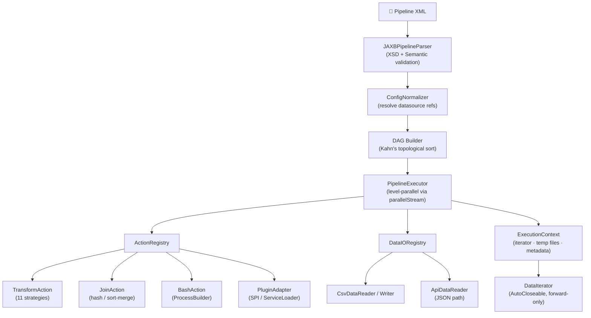
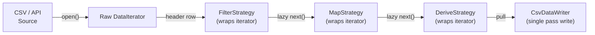
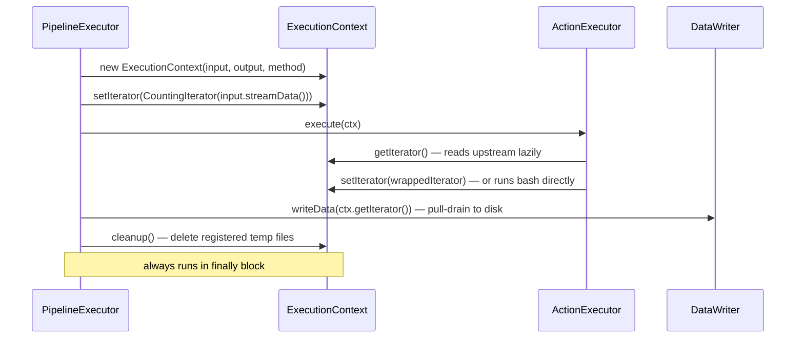
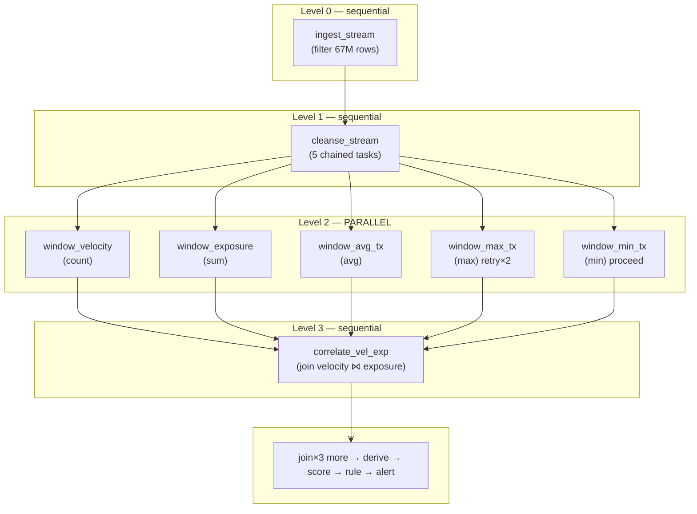
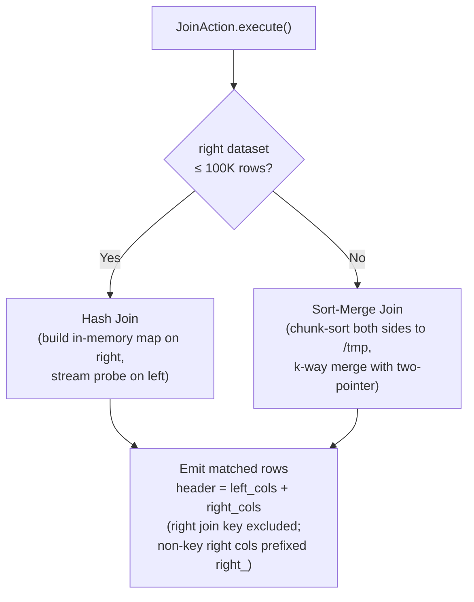

# Data Pipeline Framework

> **A declarative, XML-driven batch ETL engine for the JVM.**  
> Define complex multi-stage pipelines in XML. The engine builds a DAG, streams data through typed iterators, and executes stages in topological parallel — no code required.

**Live UI Demo →** [data-pipeline-config.netlify.app](https://data-pipeline-config.netlify.app/)

---

## Table of Contents

1. [Overview](#1-overview)
2. [Architecture](#2-architecture)
3. [Execution Flow](#3-execution-flow)
4. [Supported Actions](#4-supported-actions)
5. [Join System](#5-join-system)
6. [Example Pipelines](#6-example-pipelines)
7. [CEP-Style Positioning](#7-cep-style-positioning)
8. [Testing](#8-testing)
9. [Project Structure](#9-project-structure)
10. [How to Run](#10-how-to-run)
11. [Highlights](#11-highlights)
12. [Limitations](#12-limitations)
13. [Future Work](#13-future-work)

---

## 1. Overview

**What it is**  
A single-node, streaming batch engine that turns an XML pipeline definition into a fully-executed data workflow — without writing Java code. Pipelines are expressed as directed acyclic graphs (DAGs) of stages; each stage chains one or more transform, join, or bash tasks over a streaming iterator.

**Why it exists**  
Most ETL jobs do not need a distributed cluster. Apache Spark and Flink carry heavy operational overhead for single-machine workloads. This framework delivers:

- **Declarative pipelines** — XML over code; pipelines become readable artefacts
- **Memory safety** — strictly row-at-a-time iterators; no full-dataset materialisation except where mathematically required (sort, normalize)
- **Real throughput** — 67 million rows filtered and aggregated on a laptop in under 3 minutes
- **Extensibility** — new actions and I/O adapters register in one line via `ActionRegistry` / `DataIORegistry`

**Core idea**

```
XML definition  →  parse + validate  →  DAG  →  topological parallel execution  →  output
```

---

## 2. Architecture

### 2.1 System Architecture


```mermaid
graph TD
    XML["📄 Pipeline XML"] --> Parser["JAXBPipelineParser\n(XSD + Semantic validation)"]
    Parser --> Normalizer["ConfigNormalizer\n(resolve datasource refs)"]
    Normalizer --> DAG["DAG Builder\n(Kahn's topological sort)"]
    DAG --> Executor["PipelineExecutor\n(level-parallel via parallelStream)"]

    Executor --> AR["ActionRegistry"]
    AR --> TF["TransformAction\n(11 strategies)"]
    AR --> JA["JoinAction\n(hash / sort-merge)"]
    AR --> BA["BashAction\n(ProcessBuilder)"]
    AR --> PL["PluginAdapter\n(SPI / ServiceLoader)"]

    Executor --> IO["DataIORegistry"]
    IO --> CSV["CsvDataReader / Writer"]
    IO --> API["ApiDataReader\n(JSON path)"]

    Executor --> CTX["ExecutionContext\n(iterator · temp files · metadata)"]
    CTX --> DI["DataIterator\n(AutoCloseable, forward-only)"]
```

### 2.2 Stage / Task Abstraction

| Concept | Role |
|---|---|
| **Job** | Root container; owns global datasources and the stage list |
| **Stage** | One DAG node; declares `pre_req` dependencies and optional `on_error` policy |
| **Task** | Smallest executable unit: exactly one Input → Action → Output |
| **ExecutionContext** | Passed through a task; carries the live iterator, temp-file registry, and metadata |
| **DataIterator** | `String[]` row stream; header is always row 0; `AutoCloseable` |

Multiple tasks in one stage execute **sequentially**, each reading from the previous task's output file. Multiple stages **at the same DAG level** execute **in parallel** (`parallelStream`).

### 2.3 Iterator-Based Streaming


```mermaid
graph LR
    SRC["CSV / API\nSource"] -->|"open()"| RI["Raw DataIterator"]
    RI -->|"header row"| ACT1["FilterStrategy\n(wraps iterator)"]
    ACT1 -->|"lazy next()"| ACT2["MapStrategy\n(wraps iterator)"]
    ACT2 -->|"lazy next()"| ACT3["DeriveStrategy\n(wraps iterator)"]
    ACT3 -->|"pull"| WR["CsvDataWriter\n(single pass write)"]
```

- Each action **wraps** the upstream iterator — no intermediate copy
- Memory footprint is bounded to **one row** for all streaming operations
- Only `aggregate`, `sort`, `normalize`, and `scale` materialise the full dataset (they are mathematically one-pass-insufficient)

### 2.4 ExecutionContext Lifecycle


```mermaid
sequenceDiagram
    participant PE as PipelineExecutor
    participant CTX as ExecutionContext
    participant AE as ActionExecutor
    participant IO as DataWriter

    PE->>CTX: new ExecutionContext(input, output, method)
    PE->>CTX: setIterator(CountingIterator(input.streamData()))
    PE->>AE: execute(ctx)
    AE->>CTX: getIterator() — reads upstream lazily
    AE->>CTX: setIterator(wrappedIterator) — or runs bash directly
    PE->>IO: writeData(ctx.getIterator()) — pull-drain to disk
    PE->>CTX: cleanup() — delete registered temp files
    Note over PE,CTX: always runs in finally block
```

### 2.5 DAG Execution Model


```mermaid
graph TD
    subgraph "Level 0 — sequential"
        S0["ingest_stream\n(filter 67M rows)"]
    end
    subgraph "Level 1 — sequential"
        S1["cleanse_stream\n(5 chained tasks)"]
    end
    subgraph "Level 2 — PARALLEL"
        S2a["window_velocity\n(count)"]
        S2b["window_exposure\n(sum)"]
        S2c["window_avg_tx\n(avg)"]
        S2d["window_max_tx\n(max) retry×2"]
        S2e["window_min_tx\n(min) proceed"]
    end
    subgraph "Level 3 — sequential"
        S3["correlate_vel_exp\n(join velocity ⋈ exposure)"]
    end
    subgraph "..."
        dots["join×3 more → derive → score → rule → alert"]
    end

    S0 --> S1
    S1 --> S2a & S2b & S2c & S2d & S2e
    S2a & S2b --> S3
    S2c & S2d & S2e --> S3
    S3 --> dots
```

---

## 3. Execution Flow

```
1. Parse        JAXBPipelineParser reads XML; XSD schema validates structure
2. Validate     SemanticValidator checks IDs, datasource refs, strategy names
3. Normalise    ConfigNormalizer injects global datasource params into tasks
4. Build DAG    Kahn's algorithm; cycle detection; assign topological levels
5. Execute      PipelineExecutor iterates levels:
                  • each level → parallelStream over stages
                  • each stage → sequential tasks
                  • each task  → ExecutionContext → ActionExecutor → writeData
6. On error     abort (default) | retry (count N) | proceed (skip + continue)
7. Metrics      rowsIn / rowsOut / durationMs logged per task; JSON run snapshot saved
8. Cleanup      ExecutionContext.cleanup() deletes all registered temp files
```

---

## 4. Supported Actions

### Transform Actions

All transforms wrap the upstream `DataIterator` lazily — **O(1) memory** unless noted.

| Method | Description | Key Params | Memory |
|---|---|---|---|
| `filter` | Drop rows not matching a predicate | `column`, `operator` (`>` `<` `=` `>=` `<=`), `value` | O(1) |
| `select` | Project to named columns only | `columns` (comma-separated) | O(1) |
| `map` | Apply arithmetic to a column in-place | `column`, `operation` (`add` `subtract` `multiply` `divide`), `value` | O(1) |
| `fill_nulls` | Replace empty/null cells with a literal | `column`, `value` | O(1) |
| `drop_nulls` | Remove rows where any listed column is empty | `columns` (comma-separated) | O(1) |
| `derive` | Add a computed column via RPN formula engine | `new_column`, `formula` (e.g. `price * qty`) | O(1) |
| `aggregate` | Group-by aggregation | `group_by`, `column`, `operation` (`sum` `avg` `min` `max` `count`) | O(groups) |
| `sort` | Order rows by a column | `column`, `order` (`asc` `desc`) | O(N) |
| `limit` | Keep the first N rows | `count` | O(1) |
| `normalize` | Min-max scale a column to [0, 1] | `column` | O(N) |
| `scale` | Z-score standardise a column (μ=0, σ=1) | `column` | O(N) |

> **`derive` formula engine** — Shunting-yard RPN evaluator; supports `+ - * /`, parentheses, column references (including `_`-prefixed join columns like `right_max_price`), and numeric literals.

### Join Action

```xml
<action type="join">
  <method name="inner">
    <param name="left_key"  value="user_id"/>
    <param name="right_key" value="uid"/>
    <param name="right_ref" value="ds_orders"/>   <!-- or right_src for inline path -->
    <param name="join_strategy" value="hash"/>     <!-- optional; auto-selected -->
  </method>
</action>
```

### Bash Action

```xml
<action type="bash">
  <method name="run">
    <param name="script" value="scripts/report.sh"/>
    <param name="arg1"   value="normal"/>          <!-- optional positional args -->
  </method>
</action>
```

Script receives: `bash <script> <input_path> [arg1 arg2 ...] [output_path]`  
Scripts that write their own output file are flagged via `handlesOwnOutput()` — the framework skips the post-execution `writeData` step so the file is never overwritten.

---

## 5. Join System

### Strategy Selection


```mermaid
flowchart TD
    J["JoinAction.execute()"] --> Q{"right dataset\n≤ 100K rows?"}
    Q -->|Yes| HJ["Hash Join\n(build in-memory map on right,\nstream probe on left)"]
    Q -->|No| SMJ["Sort-Merge Join\n(chunk-sort both sides to /tmp,\nk-way merge with two-pointer)"]
    HJ --> OUT["Emit matched rows\nheader = left_cols + right_cols\n(right join key excluded;\nnon-key right cols prefixed right_)"]
    SMJ --> OUT
```

### Join Types vs. Join Strategy

| Dimension | Values | Controls |
|---|---|---|
| **join type** (`method name`) | `inner` | Which rows appear in output |
| **join strategy** (`join_strategy` param) | `hash` (default auto) · `sort_merge` (force) | How matching is computed |

### Column Naming After Join

Left dataset `[brand, sum_price]` joined with right `[brand, count_product_id]` on `brand`:

```
Output → [brand, sum_price, right_count_product_id]
```

- Left columns: unchanged
- Right join key: dropped (already present from left)
- Right non-key columns: prefixed `right_`

Chain four joins to build a wide analytics table:

```
join1 → [session, count_product_id, right_sum_price]
join2 → [session, count_product_id, right_sum_price, right_avg_price]
join3 → [session, count_product_id, right_sum_price, right_avg_price, right_max_price]
join4 → [session, count_product_id, right_sum_price, right_avg_price, right_max_price, right_min_price]
```

### Temp File Cleanup

Sort-merge join writes sorted chunks to `/tmp/sort_*.csv`. All paths are registered in `ExecutionContext`; `cleanup()` deletes them in a `finally` block guaranteed to run even on pipeline failure.

---

## 6. Example Pipelines

### 6.1 Black Friday Revenue Intelligence

**Input:** 2019-Nov.csv — 67.5 million raw e-commerce events  
**Output:** `target/blackfriday/report.txt` — ranked revenue leaderboard

```
[1] filter_purchases          67M events → 916,940 purchase rows
[2a] aggregate_revenue   ─┐   sum(price)   by category   (parallel)
[2b] aggregate_volume    ─┴─► count(orders) by category  (parallel)
[3] join_metrics              revenue ⋈ volume on category_code
[4] derive_and_rank           AOV = revenue/orders → sort → top 10
[5] generate_report           bash: leaderboard.sh → report.txt
```

**Result (top 3):**

| Rank | Category | Revenue (€) | Orders | Avg Order |
|---|---|---|---|---|
| 1 | electronics.smartphone | 177,821,661 | 382,647 | 464.71 |
| 2 | UNKNOWN | 29,880,506 | 234,218 | 127.58 |
| 3 | electronics.video.tv | 12,457,151 | 30,274 | 411.48 |

```xml
<!-- Parallel aggregation — both stages share the same pre_req -->
<stage id="aggregate_revenue" pre_req="filter_purchases"> ... </stage>
<stage id="aggregate_volume"  pre_req="filter_purchases"> ... </stage>

<!-- Multi-dependency join waits for both -->
<stage id="join_metrics" pre_req="aggregate_revenue aggregate_volume"> ... </stage>
```

---

### 6.2 CEP-Style Fraud Detection

**Input:** 2019-Nov.csv  
**Output:** `target/cep_fraud/fraud_report.txt` — top-50 flagged sessions

**CEP model mapping:**

| CEP Concept | Framework Implementation |
|---|---|
| Event stream | 2019-Nov.csv — 67M rows treated as an ordered event log |
| Session window | `GROUP BY user_session` in aggregate stages |
| Pattern extraction | 5 parallel aggregations per session (count/sum/avg/max/min) |
| Signal correlation | 4 sequential hash joins building a wide session profile |
| Composite signal | `derive`: `velocity_risk = count * avg_price` |
| Risk scoring | `normalize` → [0,1]; `map` × 100 → risk points |
| Rule evaluation | `filter(count_product_id >= 3)` — velocity burst rule |
| Alert ranking | `sort(desc)` + `limit(50)` — alert queue |
| Action trigger | `bash`: `cep_fraud_alert.sh` → structured fraud report |

> ⚠️ **This is NOT real-time CEP.** The framework is a batch engine — the "event stream" is a static file processed in a single run. There is no true time-windowing, no out-of-order event handling, and no sub-second latency. The CEP terminology describes the *analytical structure* of the pipeline, not its runtime model.

**Result:**
- 25,422 sessions matched rule (`count ≥ 3`)
- Top-50 alert queue: total exposure **€677,408**
- Highest-risk session: 76 transactions · €76,067 spend · risk score **100/100**

```
[L0]  ingest_stream       filter 67M → purchase events
[L1]  cleanse_stream      fill_nulls × 2 → drop_nulls → map(USD→EUR) → select  [5 tasks]
[L2]  window_*            COUNT / SUM / AVG / MAX / MIN per session             [5 PARALLEL]
[L3–6] correlate_*        4 sequential joins → full session profile
[L7]  extract_patterns    derive price_range + velocity_risk                    [2 tasks]
[L8]  score_risk          normalize → scale → map × 100                        [3 tasks]
[L9]  evaluate_rules      filter(count≥3) → sort(desc) → limit(50)             [3 tasks]
[L10] trigger_alert       bash: cep_fraud_alert.sh
```

---

## 7. CEP-Style Positioning

The framework simulates CEP analytics through batch iteration. The table below clarifies what it does and does not provide:

| True CEP | This Framework |
|---|---|
| Continuous real-time ingestion | Single-file batch run |
| Sub-millisecond event processing | Minutes (I/O bound) |
| Sliding / tumbling time windows | Session windows via GROUP BY |
| Out-of-order event handling | None — rows processed in file order |
| Stateful stream operators | Stateless per-row iterators (state via aggregation) |
| Distributed fault tolerance | Single-node, retry/proceed at stage level |
| Pattern: SEQ(A, B) within 5s | Pattern: COUNT(A) ≥ N within session group |

**Where it adds value:** historical fraud analysis, post-hoc anomaly detection, batch scoring of behavioural signals — all without a Kafka or Flink cluster.

---

## 8. Testing

Test suite: `ActionValidationTest.java` (53 tests) + `PipelineTest.java` (end-to-end)

### Test Categories

| Category | What is verified |
|---|---|
| **Streaming safety** | `hasNext()` is idempotent — calling it N times before `next()` never skips or duplicates rows; source iterator consumed exactly once |
| **Transform correctness** | Every strategy (filter, map, aggregate × 5 ops, derive, normalize, scale, sort, limit, fill_nulls, drop_nulls, select) verified with in-memory row arrays |
| **Many-to-many join explosion** | Left × right duplicate keys produce the full Cartesian product (M × N rows) |
| **Sort-merge join temp cleanup** | After forcing `join_strategy=sort_merge`, all `/tmp/sort_*.csv` files are deleted from `ExecutionContext` even when the pipeline completes successfully |
| **Large dataset (67M rows)** | Single-pass aggregate over 2019-Nov.csv completes in < 300 s with no OOM |
| **Deterministic output** | Two successive runs on identical input produce byte-identical output files |
| **Error handling** | Pipeline correctly retries N times on `retry` strategy; continues on `proceed`; halts on `abort` |
| **Formula engine** | RPN evaluator handles nested parentheses, operator precedence, underscore column names (`right_max_price - right_min_price`) |

### Running Tests

```bash
mvn test -Djacoco.skip=true
```

---

## 9. Project Structure

```
data-pipeline-framework/
├── src/
│   ├── main/
│   │   ├── java/org/example/datapipeline/
│   │   │   ├── Main.java                        # CLI entry point
│   │   │   ├── cli/
│   │   │   │   └── Pipeline.java                # run() / replay() / list-runs()
│   │   │   ├── config/                          # JAXB object model
│   │   │   │   ├── Job.java Stage.java Task.java OnError.java
│   │   │   │   ├── action/       
│   │   │   │   │       ├── Action.java
│   │   │   │   │       ├── Method.java
│   │   │   │   │       └── Param.java   
│   │   │   │   ├── input/    
│   │   │   │   │       └── Input.java  
│   │   │   │   └── output/   
│   │   │   │           └── Output.java 
│   │   │   ├── executor/
│   │   │   │   ├── PipelineExecutor.java           # DAG orchestrator
│   │   │   │   ├── action/
│   │   │   │   │   ├── ActionExecutor.java         # interface (+ handlesOwnOutput())
│   │   │   │   │   ├── ActionRegistry.java         # type → executor map
│   │   │   │   │   ├── BashAction.java
│   │   │   │   │   ├── join/  
│   │   │   │   │   │    └── JoinAction.java      # hash + sort-merge  
│   │   │   │   │   └── transform/
│   │   │   │   │       ├── TransformAction.java    # method dispatcher
│   │   │   │   │       ├── TransformStrategy.java
│   │   │   │   │       ├── FilterStrategy.java   
│   │   │   │   │       ├── AggregateStrategy.java 
│   │   │   │   │       ├── SelectStrategy.java   
│   │   │   │   │       ├── LimitStrategy.java    
│   │   │   │   │       ├── DropNullsStrategy.java 
│   │   │   │   │       ├── MapStrategy.java
│   │   │   │   │       ├── DeriveStrategy.java
│   │   │   │   │       ├── SortStrategy.java
│   │   │   │   │       ├── FillNullsStrategy.java
│   │   │   │   │       ├── NormalizeStrategy.java
│   │   │   │   │       ├── MaxStrategy.java
│   │   │   │   │       └── ScaleStrategy.java    
│   │   │   │   ├── context/  
│   │   │   │   │   └── ExecutionContext.java
│   │   │   │   ├── io/
│   │   │   │   │   ├── DataIORegistry.java
│   │   │   │   │   ├── CsvDataReader.java  
│   │   │   │   │   ├── CsvDataWriter.java
│   │   │   │   │   └── ApiDataReader.java
│   │   │   │   ├── iterator/
│   │   │   │   │   ├── DataIterator.java         # AutoCloseable, String[]
│   │   │   │   │   ├── CsvDataIterator.java
│   │   │   │   │   └── ApiDataIterator.java
│   │   │   │   └── metrics/
│   │   │   │       ├── CountingIterator.java
│   │   │   │       └── TaskMetrics.java
│   │   │   ├── parser/    
│   │   │   │   └── JAXBPipelineParser.java
│   │   │   ├── validator/ 
│   │   │   │   └── SemanticValidator.java
│   │   │   ├── util/        
│   │   │   │   ├── ConfigNormalizer.java
│   │   │   │   └── LoggingConfig.java
│   │   │   ├── plugin/        
│   │   │   │   ├── ActionPlugin.java
│   │   │   │   ├── PluginAdapter.java
│   │   │   │   └── Executor.java
│   │   │   ├── onboarding/
│   │   │   │   ├── AssignRollNumberPlugin.java
│   │   │   │   ├── GenerateEmailIdPlugin.java
│   │   │   │   ├── HttpRequestPlugin.java
│   │   │   │   └── GeneratePdfPlugin.java
│   │   │   └── versioning/
│   │   │       ├── PipelineRun.java    
│   │   │       ├── StageRun.java
│   │   │       ├── TaskRun.java
│   │   │       ├── PipelineRunManager.java 
│   │   │       ├── JsonPipelineRunManager.java
│   │   │       └── ReplayService.java
│   │   └── resources/
│   │       ├── schema/         
│   │       │   └── job.xsd
│   │       ├── pipeline_config/
│   │       │   ├── pipeline_blackfriday.xml      # Black Friday revenue intelligence
│   │       │   ├── pipeline_brandscorecard.xml   # Brand performance scorecard
│   │       │   ├── pipeline_cep_fraud.xml        # CEP-style fraud detection
│   │       │   ├── pipeline_etl.xml              # General ETL demo
│   │       │   ├── pipeline_fraud.xml            # Simple fraud analysis
│   │       │   ├── pipeline_onboarding.xml       # Plugin demo (PDF, email, HTTP)
│   │       │   └── test_*.xml                    # Test fixtures
│   │       ├── scripts/
│   │       │   ├── leaderboard.sh               # Black Friday ANSI report
│   │       │   ├── brand_scorecard.sh           # Brand scorecard report
│   │       │   ├── cep_fraud_alert.sh           # CEP fraud alert report
│   │       │   └── enrich.sh
│   │       ├── input/
│   │       │   └── 2019-Nov.csv                 # 67.5M row e-commerce dataset
│   │       └── META-INF/services/
│   │           └── org.example.datapipeline.plugin.ActionPlugin
│   └── test/
│       └── java/org/example/datapipeline/
│           ├── ActionValidationTest.java         # 53 unit tests
│           └── PipelineTest.java                 # End-to-end integration test
├── pom.xml
└── README.md
```

---

## 10. How to Run

### Prerequisites

- Java 17+
- Maven 3.8+

### Build

```bash
mvn clean package -Djacoco.skip=true
```

### Run a Pipeline

```bash
# Black Friday revenue intelligence (67M rows, ~3 min)
mvn exec:java \
  -Dexec.mainClass="org.example.datapipeline.Main" \
  -Dexec.args="src/main/resources/pipeline_config/pipeline_blackfriday.xml"

# CEP-style fraud detection
mvn exec:java \
  -Dexec.mainClass="org.example.datapipeline.Main" \
  -Dexec.args="src/main/resources/pipeline_config/pipeline_cep_fraud.xml"

# Brand performance scorecard (all 14 action types)
mvn exec:java \
  -Dexec.mainClass="org.example.datapipeline.Main" \
  -Dexec.args="src/main/resources/pipeline_config/pipeline_brandscorecard.xml"
```

### Run / Replay / List Runs

```bash
# List historical runs
java -cp target/classes org.example.datapipeline.Main --list-runs

# Replay a previous run by ID
java -cp target/classes org.example.datapipeline.Main --replay <run_id>
```

### Run Tests

```bash
mvn test -Djacoco.skip=true
```

### Minimal Pipeline XML

```xml
<?xml version="1.0" encoding="UTF-8"?>
<job id="my-pipeline">

  <datasources>
    <datasource id="raw" type="csv">
      <param name="src" value="input/events.csv"/>
    </datasource>
  </datasources>

  <!-- Stage 1: filter to purchases -->
  <stage id="filter_purchases">
    <task>
      <input ref="raw"/>
      <action type="transform">
        <method name="filter">
          <param name="column"   value="event_type"/>
          <param name="operator" value="="/>
          <param name="value"    value="purchase"/>
        </method>
      </action>
      <output type="csv">
        <param name="src" value="target/purchases.csv"/>
      </output>
    </task>
  </stage>

  <!-- Stage 2: aggregate revenue by category (runs after stage 1) -->
  <stage id="aggregate_revenue" pre_req="filter_purchases">
    <on_error handling_strategy="retry" retry_count="2"/>
    <task>
      <input type="csv">
        <param name="src" value="target/purchases.csv"/>
      </input>
      <action type="transform">
        <method name="aggregate">
          <param name="group_by"  value="category_code"/>
          <param name="operation" value="sum"/>
          <param name="column"    value="price"/>
        </method>
      </action>
      <output type="csv">
        <param name="src" value="target/revenue_by_category.csv"/>
      </output>
    </task>
  </stage>

</job>
```

---

## 11. Highlights

| Metric | Value |
|---|---|
| Dataset size | 67.5 million rows (2019-Nov.csv, ~8 GB) |
| Filter pass throughput | ~430,000 rows/sec |
| Parallel aggregations | 5 strategies on the same file concurrently |
| Join type | Hash join (≤100K rows) auto-selected; sort-merge for larger |
| Peak heap pressure | Single row at a time for streaming ops |
| OOM threshold | None — scale limited only by sort/normalize materialisation |
| Pipeline definition | 100% declarative XML; zero Java code per pipeline |
| Stage parallelism | `parallelStream` — all DAG-level-siblings execute concurrently |
| Error handling | `abort` · `retry(N)` · `proceed` — per stage |
| Extensibility | New action → 1 class + 1 registry line; new format → 1 class |
| Action coverage | 14 action types across 3 categories (transform / join / bash) |
| Test coverage | 53 unit tests + integration test; streaming safety verified |

---

## 12. Limitations

- **Not real-time** — batch-only; no event-by-event latency guarantees
- **Not distributed** — single JVM, single node; no sharding or cluster coordination
- **Inner join only** — left / right / full outer joins are not yet implemented
- **No true time-windowing** — session windows are emulated via `GROUP BY`, not temporal sliding/tumbling windows
- **Sort and normalize are O(N) memory** — they materialise the full dataset; not suitable for datasets larger than available RAM
- **CSV only (no RFC compliance)** — commas inside quoted fields break the parser (`String.split(",")`)
- **No pipeline timeout / cancellation** — a stalled bash script or slow I/O blocks the stage thread indefinitely
- **UTF-8 only** — all I/O is hardcoded to `StandardCharsets.UTF_8`

---

## 13. Future Work

| Area | Description |
|---|---|
| **Outer joins** | Implement left, right, full outer join semantics in `JoinAction` |
| **True streaming** | Kafka source/sink adapters; frame as micro-batch windows |
| **Distributed execution** | Master–worker sharding via gRPC; compatible DAG serialisation |
| **RFC CSV parser** | Replace `String.split` with OpenCSV or Apache Commons CSV |
| **Pipeline timeout** | Wrap stages in `CompletableFuture` with configurable deadline |
| **Pipeline UI** | Visual DAG editor to generate XML; [prototype exists](https://data-pipeline-config.netlify.app/) |
| **Task-level chaining** | Pass iterators directly between intra-stage tasks without intermediate disk writes |
| **More join types** | Anti-join, semi-join for existence checks |
| **Columnar format** | Parquet reader/writer for compressed analytical workloads |

---

## XML Schema Reference

```
job (id)
├── datasources?
│   └── datasource* (id, type)
│         └── param* (name, value)
└── stage* (id, pre_req?)          ← pre_req = space-separated stage IDs (xs:IDREFS)
    ├── on_error? (handling_strategy, retry_count?)
    └── task+
        ├── input  (ref? | type + param)
        ├── action (type)
        │     └── method (name)
        │           └── param* (name, value)
        └── output (ref? | type + param)
```

`handling_strategy` values: `abort` (default) · `retry` · `proceed`  
`type` values for input/output: `csv` · `api`  
`type` values for action: `transform` · `join` · `bash` · *(plugin type)*

---

*Built with Java · JAXB · JUnit 5 · Maven*
