# DPipe


A declarative batch ETL engine written from scratch in Java 17.

A pipeline is an XML file. The engine validates it against an XSD schema,
unmarshals it with JAXB into a typed object graph, checks it semantically,
orders its stages into a dependency DAG with Kahn's topological sort, and runs
the DAG level by level, with the independent stages of each level running
concurrently. Rows move through a lazy, pull-based chain of iterators: nothing
is read from disk until the writer at the end asks for the next row, so the
row-local operators process files far larger than memory while holding a single
row. Operators are Strategy objects in a registry, and new action types arrive
through Java's `ServiceLoader` SPI without touching the engine. Every run is
recorded with a snapshot of its XML so it can be replayed. The only runtime
dependencies are JAXB and `org.json`.

```text
$ mvn -q compile
$ mvn -q exec:java -Dexec.mainClass=org.example.datapipeline.Main \
      -Dexec.args="src/main/resources/pipeline_config/pipeline-join-aggregate-test.xml"
Pipeline loaded: full-feature-pipeline
Stages: 4

----- PIPELINE STAGES -----

Stage: join_stage
Dependencies: []
  Task:
    Input: src/main/resources/input/users.csv
    Action: join
    Output: src/main/resources/output/join_output.csv
  ...

---- TOPOLOGICAL LEVEL ORDER ----

Level 0: [join_stage]
Level 1: [clean_stage]
Level 2: [aggregation_stage]
Level 3: [meta_aggregation_stage]

$ cat src/main/resources/output/join_output.csv
user_id,name,country,right_order_id,right_amount,right_category
1,Alice,India,1,100,electronics
1,Alice,India,2,200,fashion
2,Bob,India,3,300,grocery
2,Bob,India,4,400,books
3,Charlie,USA,5,500,electronics
3,Charlie,USA,6,600,fashion
4,David,USA,7,700,books
5,Eve,UK,8,800,grocery
5,Eve,UK,9,900,electronics
$ cat src/main/resources/output/country_sum.csv
country,sum_right_amount
USA,1800.0
UK,1700.0
India,1000.0
$ cat src/main/resources/output/max_country_sum.csv
max_sum_right_amount
1800.0
```

That pipeline joins the 5-row `users.csv` with the 9-row `orders.csv`, drops
incomplete rows, computes five aggregations over the result, and then takes a
global maximum over one of them. The transcript is from a real run, trimmed
where it prints the remaining stages; the same aggregate values are asserted
by the end-to-end test in `PipelineTest`. Log lines are omitted above; they go
to stderr and to `logs/pipeline.log`, and are shown in
[Logging and metrics](#logging-and-metrics).

---

## Contents

- [At a glance](#at-a-glance)
- [Architecture](#architecture)
- [From XML to an executable graph](#from-xml-to-an-executable-graph)
  - [The configuration model](#the-configuration-model)
  - [Parsing: XSD and JAXB in one call](#parsing-xsd-and-jaxb-in-one-call)
  - [Datasource resolution](#datasource-resolution)
  - [Semantic validation](#semantic-validation)
  - [Normalization](#normalization)
- [Scheduling: the DAG](#scheduling-the-dag)
  - [Kahn's algorithm, one level at a time](#kahns-algorithm-one-level-at-a-time)
  - [Worked example: Black Friday](#worked-example-black-friday)
  - [Why Kahn's and not a DFS sort](#why-kahns-and-not-a-dfs-sort)
- [Execution](#execution)
  - [One run, end to end](#one-run-end-to-end)
  - [Inside a stage](#inside-a-stage)
  - [Life of a task](#life-of-a-task)
  - [Stage and run status](#stage-and-run-status)
- [The streaming model](#the-streaming-model)
  - [The DataIterator contract](#the-dataiterator-contract)
  - [Pull, don't push](#pull-dont-push)
  - [The header contract](#the-header-contract)
  - [Streaming and blocking operators](#streaming-and-blocking-operators)
  - [Counting rows without touching them](#counting-rows-without-touching-them)
- [Operators](#operators)
  - [Dispatch through a strategy registry](#dispatch-through-a-strategy-registry)
  - [Row-local operators](#row-local-operators)
  - [The derive formula engine](#the-derive-formula-engine)
  - [Aggregation](#aggregation)
  - [Global operators](#global-operators)
  - [Operator reference](#operator-reference)
- [Joins](#joins)
  - [Output schema](#output-schema)
  - [Hash join](#hash-join)
  - [Sort-merge join with external sort](#sort-merge-join-with-external-sort)
  - [Choosing a strategy](#choosing-a-strategy)
- [Bash actions](#bash-actions)
- [Plugins](#plugins)
- [I/O](#io)
- [Concurrency model](#concurrency-model)
- [Failure handling](#failure-handling)
- [Run history and replay](#run-history-and-replay)
- [Logging and metrics](#logging-and-metrics)
- [Class model (UML)](#class-model-uml)
- [Example pipelines](#example-pipelines)
- [Command line](#command-line)
- [Pipeline XML reference](#pipeline-xml-reference)
- [Build, run, test](#build-run-test)
- [Project layout](#project-layout)
- [Design decisions and trade-offs](#design-decisions-and-trade-offs)
- [Known limitations](#known-limitations)

---

## At a glance

| Aspect | Choice |
|---|---|
| Language and build | Java 17, Maven. Runtime dependencies: `jakarta.xml.bind-api`, `jaxb-runtime`, `org.json`. Tests: JUnit 5 |
| Pipeline definition | XML, validated against `job.xsd` and unmarshalled by JAXB into typed config objects |
| Validation | XSD for structure, then `SemanticValidator` for meaning: stage IDs, tasks, per-operator required parameters, join and error-policy rules |
| Scheduling | Kahn's topological sort groups stages into levels; `O(V + E)`, cycles rejected before anything runs |
| Parallelism | Levels run in order; the stages inside one level run concurrently via `parallelStream()` on the common `ForkJoinPool` |
| Execution model | Lazy pull-based iterator chain (the Volcano model); rows are `String[]`, header first |
| Memory | Constant for row-local operators; `O(groups)` for aggregate; `O(n)` for sort, normalize, scale; `O(right side)` for a hash join; `O(chunk)` for a sort-merge join |
| Operators | 12 transforms, a join, a bash action, and 4 bundled plugins |
| Joins | Hash join (inner, left, right, full) and sort-merge join (inner) with external sort: 50,000-row sorted runs merged by a `PriorityQueue` |
| I/O | CSV in and out, JSON-over-HTTP in |
| Failure policy | Per stage: `abort` (default), `retry` with a count, or `proceed` |
| Extensibility | Transforms are Strategy objects; new action types load through `ServiceLoader` and a `PluginAdapter` |
| Run history | Every run is saved as `runs/<uuid>.json` with its XML snapshot; `--replay <id>` re-runs it |
| Tests | 53 operator, join, plugin and pipeline tests plus one end-to-end test |
| Scale | Validated on the 67.5M-row, ~8 GB November 2019 e-commerce dataset (downloaded separately) |

---

## Architecture

The engine is a single JVM process. Everything before the executor is
compilation: it turns an XML file into a validated, ordered plan and never
touches data. The executor then walks the plan, and for each task it opens a
reader, wraps it in operator iterators, and lets a writer pull rows through.

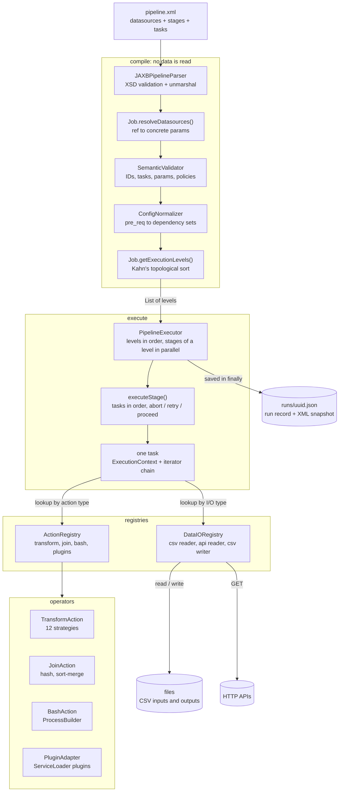
```mermaid
flowchart TB
    XML["pipeline.xml<br/>datasources + stages + tasks"]

    subgraph COMPILE["compile: no data is read"]
        direction LR
        PR["JAXBPipelineParser<br/>XSD validation + unmarshal"]
        RS["Job.resolveDatasources()<br/>ref to concrete params"]
        SV["SemanticValidator<br/>IDs, tasks, params, policies"]
        CN["ConfigNormalizer<br/>pre_req to dependency sets"]
        KH["Job.getExecutionLevels()<br/>Kahn's topological sort"]
        PR --> RS --> SV --> CN --> KH
    end

    subgraph EXEC["execute"]
        direction TB
        PE["PipelineExecutor<br/>levels in order, stages of a level in parallel"]
        ST["executeStage()<br/>tasks in order, abort / retry / proceed"]
        TK["one task<br/>ExecutionContext + iterator chain"]
        PE --> ST --> TK
    end

    subgraph REG["registries"]
        direction LR
        AR["ActionRegistry<br/>transform, join, bash, plugins"]
        IO["DataIORegistry<br/>csv reader, api reader, csv writer"]
    end

    subgraph OPS["operators"]
        direction LR
        TA["TransformAction<br/>12 strategies"]
        JA["JoinAction<br/>hash, sort-merge"]
        BA["BashAction<br/>ProcessBuilder"]
        PA["PluginAdapter<br/>ServiceLoader plugins"]
    end

    DISK[("files<br/>CSV inputs and outputs")]
    HTTP[("HTTP APIs")]
    RUNS[("runs/uuid.json<br/>run record + XML snapshot")]

    XML --> PR
    KH -->|"List of levels"| PE
    TK -->|"lookup by action type"| AR
    TK -->|"lookup by I/O type"| IO
    AR --> OPS
    IO -->|"read / write"| DISK
    IO -->|"GET"| HTTP
    PE -->|"saved in finally"| RUNS
```

Seen as the layers of a query engine:

| Layer | In DPipe |
|---|---|
| Query language | Pipeline XML: datasources, stages, tasks, actions, parameters |
| Parsing and validation | XSD schema, JAXB unmarshalling, `SemanticValidator` |
| Planning | `ConfigNormalizer` and Kahn's topological sort into execution levels. There is no optimizer: the plan is the DAG the user wrote |
| Execution | `PipelineExecutor`: level-synchronous scheduling, per-stage failure policy, per-task metrics |
| Operators | Iterator-based transforms, joins, bash actions and plugins |
| Storage | CSV files between stages, run records in `runs/` |

What keeps it lean is a small set of choices that reinforce each other:

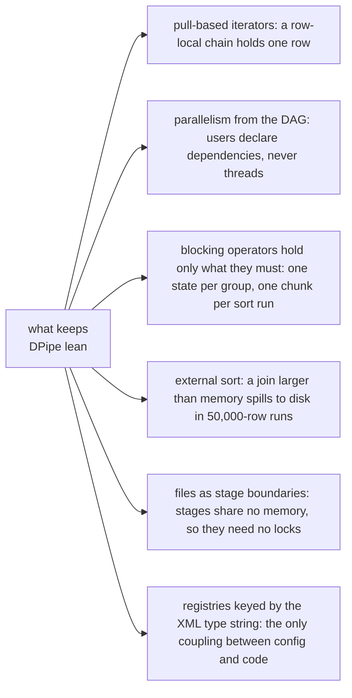
```mermaid
flowchart LR
    F["what keeps<br/>DPipe lean"] --> A["pull-based iterators: a row-local chain holds one row"]
    F --> B["parallelism from the DAG: users declare dependencies, never threads"]
    F --> C["blocking operators hold only what they must: one state per group, one chunk per sort run"]
    F --> D["external sort: a join larger than memory spills to disk in 50,000-row runs"]
    F --> E["files as stage boundaries: stages share no memory, so they need no locks"]
    F --> G["registries keyed by the XML type string: the only coupling between config and code"]
```

---

## From XML to an executable graph

### The configuration model

A pipeline has one `<job>`. The job declares named `<datasources>` once, and a
list of `<stage>` elements. A stage lists the stages it depends on in
`pre_req` and holds one or more `<task>` elements. A task is the unit of work:
exactly one input, one action and one output.

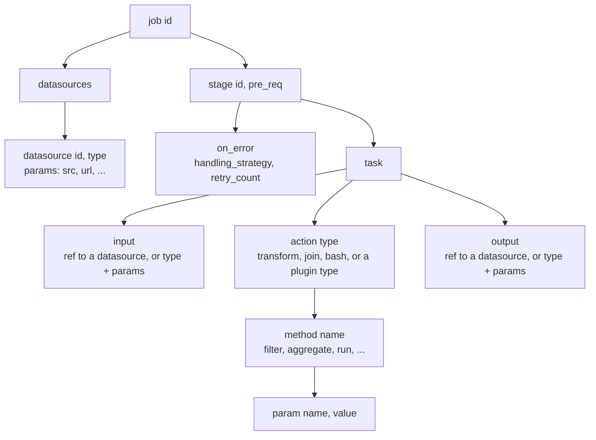
```mermaid
flowchart TB
    J["job id"] --> DS["datasources"]
    DS --> D1["datasource id, type<br/>params: src, url, ..."]
    J --> S1["stage id, pre_req"]
    S1 --> OE["on_error<br/>handling_strategy, retry_count"]
    S1 --> T1["task"]
    T1 --> IN["input<br/>ref to a datasource, or type + params"]
    T1 --> AC["action type<br/>transform, join, bash, or a plugin type"]
    AC --> MT["method name<br/>filter, aggregate, run, ..."]
    MT --> PM["param name, value"]
    T1 --> OUT["output<br/>ref to a datasource, or type + params"]
```

| Concept | Role |
|---|---|
| `Job` | Root. Owns the datasource catalogue and the stage list; builds the lookup maps and the execution levels |
| `Datasource` | A named, reusable I/O endpoint: an `id`, a `type` (`csv`, `api`) and parameters |
| `Stage` | One node of the DAG. Declares dependencies (`pre_req`) and an optional failure policy (`on_error`) |
| `Task` | One input, one action, one output. Tasks in a stage run in declaration order |
| `Action` / `Method` / `Param` | Which executor runs (`type`), which operation it performs (`method name`), and its parameters |
| `Input` / `Output` | Either a `ref` to a datasource or an inline `type` with `<param>`s, resolved into one parameter map |

Tasks in the same stage do not share memory. Each task opens its own input and
writes its own output, so a multi-task stage chains by pointing each task's
input at the previous task's output file. The Black Friday pipeline's
`derive_and_rank` stage is three tasks linked that way:
`with_aov.csv`, then `sorted.csv`, then `top10.csv`.

### Parsing: XSD and JAXB in one call

`JAXBPipelineParser.parse()` attaches the schema to the unmarshaller before
reading, so structural validation and object construction happen in a single
pass:

```java
JAXBContext context = JAXBContext.newInstance(Job.class);
Unmarshaller unmarshaller = context.createUnmarshaller();

SchemaFactory sf = SchemaFactory.newInstance(XMLConstants.W3C_XML_SCHEMA_NS_URI);
Schema schema = sf.newSchema(new File("src/main/resources/schema/job.xsd"));
unmarshaller.setSchema(schema);

return (Job) unmarshaller.unmarshal(new File(xmlPath));
```

The XSD rejects anything structurally wrong before a single Java object
exists: a task without an `<output>`, an `on_error` whose strategy is not one
of `retry`, `abort`, `proceed`, a `retry_count` that is not a non-negative
integer, a `pre_req` naming an ID that does not exist in the document. A
schema violation surfaces as a `PipelineValidationException` that names the
file, line and column:

```text
Pipeline validation failed
File: pipeline.xml
Line: 42, Column: 15
Issue: Missing required element <output> inside <task>
```

The JAXB annotations map elements straight onto fields:

```java
@XmlRootElement(name = "job")
@XmlAccessorType(XmlAccessType.FIELD)
public class Job {
    @XmlAttribute                                   private String id;
    @XmlElementWrapper(name = "datasources")
    @XmlElement(name = "datasource")                private List<Datasource> datasources;
    @XmlElement(name = "stage")                     private List<Stage> stages;
    private transient Map<String, Stage>      stageMap;        // built after parsing
    private transient Map<String, Datasource> datasourceMap;   // built after parsing
}
```

### Datasource resolution

A task can reference a global datasource (`<input ref="ds_orders"/>`), declare
its I/O inline (`<input type="csv"><param name="src" .../></input>`), or do
both. `Input.resolve()` and `Output.resolve()` flatten either form into one
`resolvedParams` map, which is all a reader or writer ever sees:

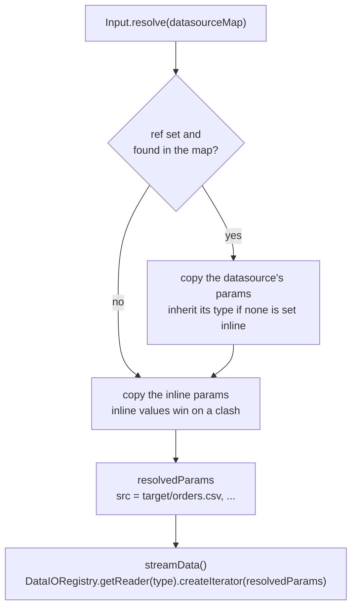
```mermaid
flowchart TD
    A["Input.resolve(datasourceMap)"] --> B{"ref set and<br/>found in the map?"}
    B -->|yes| C["copy the datasource's params<br/>inherit its type if none is set inline"]
    B -->|no| D
    C --> D["copy the inline params<br/>inline values win on a clash"]
    D --> E["resolvedParams<br/>src = target/orders.csv, ..."]
    E --> F["streamData()<br/>DataIORegistry.getReader(type).createIterator(resolvedParams)"]
```

`Job.resolveDatasources()` runs this for every task right after parsing, and
the executor runs it again on each task before execution. A join's right side
is resolved later still: `JoinAction` looks its `right_ref` up in the
datasource map at run time, through the execution context.

### Semantic validation

The XSD knows structure, not meaning. `SemanticValidator` is the second gate:

| Check | Rejects |
|---|---|
| Stage IDs | A missing, blank or duplicated stage ID |
| Dependencies | A `pre_req` naming an ID that is not in the document is already rejected by the XSD's `xs:IDREFS` type. The validator's own dependency check runs before `pre_req` is parsed, so it adds nothing today; see [Known limitations](#known-limitations) |
| Tasks | A stage with no tasks; a task with no input, action or output |
| Transform parameters | Any of the 12 methods missing a required parameter, e.g. `filter` without `column`, `operator`, `value` |
| Join parameters | Missing `left_key` or `right_key`; neither `right_src` nor `right_ref`; a `join_type` outside `inner`, `left`, `right`, `full`; a `join_strategy` outside `hash`, `sort_merge`; `sort_merge` with anything but `inner` |
| Bash | `run` without a `script` |
| Error policy | A blank or unknown `handling_strategy`; `retry` without a `retry_count`; a negative count; a `retry_count` on `abort` or `proceed` |

The validator fails fast: the first problem throws, and nothing executes.

### Normalization

`ConfigNormalizer` turns the human-friendly config into algorithm-friendly
structures. It splits each stage's `pre_req` string on whitespace into a
`Set<String>` of dependencies, rejecting a stage that lists itself, and it
builds the stage and datasource lookup maps:

```java
public void normalizeDependencies() {
    if (preReq == null || preReq.trim().isEmpty()) return;
    for (String dep : preReq.trim().split("\\s+")) {
        if (dep.equals(id))
            throw new RuntimeException("Stage cannot depend on itself: " + id);
        dependencies.add(dep);
    }
}
```

The whole compile phase, as `Pipeline.run()` sequences it:

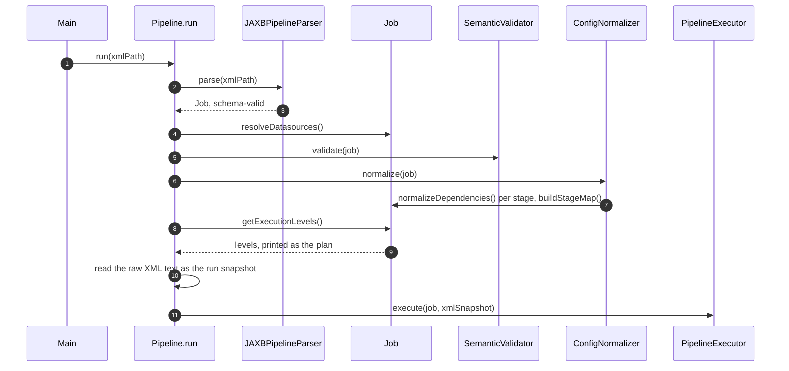
```mermaid
sequenceDiagram
    autonumber
    participant M as Main
    participant P as Pipeline.run
    participant X as JAXBPipelineParser
    participant J as Job
    participant V as SemanticValidator
    participant N as ConfigNormalizer
    participant E as PipelineExecutor
    M->>P: run(xmlPath)
    P->>X: parse(xmlPath)
    X-->>P: Job, schema-valid
    P->>J: resolveDatasources()
    P->>V: validate(job)
    P->>N: normalize(job)
    N->>J: normalizeDependencies() per stage, buildStageMap()
    P->>J: getExecutionLevels()
    J-->>P: levels, printed as the plan
    P->>P: read the raw XML text as the run snapshot
    P->>E: execute(job, xmlSnapshot)
```

---

## Scheduling: the DAG

### Kahn's algorithm, one level at a time

Stages and their `pre_req` edges form a directed graph. `Job.getExecutionLevels()`
sorts it with Kahn's algorithm, a breadth-first topological sort, and keeps the
breadth-first waves apart. Each wave is one **execution level**: a set of
stages whose dependencies have all been placed in earlier levels, which makes
the stages inside a level independent of one another.

```java
Queue<String> queue = new LinkedList<>();
for (String id : indegree.keySet())
    if (indegree.get(id) == 0) queue.add(id);          // stages with no dependencies

List<List<Stage>> levels = new ArrayList<>();
int processed = 0;
while (!queue.isEmpty()) {
    int size = queue.size();                           // snapshot: this wave only
    List<Stage> level = new ArrayList<>();
    for (int i = 0; i < size; i++) {
        String curr = queue.poll();
        processed++;
        level.add(stageMap.get(curr));
        for (String next : graph.get(curr)) {          // edge: curr must run before next
            indegree.put(next, indegree.get(next) - 1);
            if (indegree.get(next) == 0) queue.add(next);
        }
    }
    levels.add(level);
}
if (processed != stages.size())
    throw new RuntimeException("Pipeline contains cyclic dependencies");
```

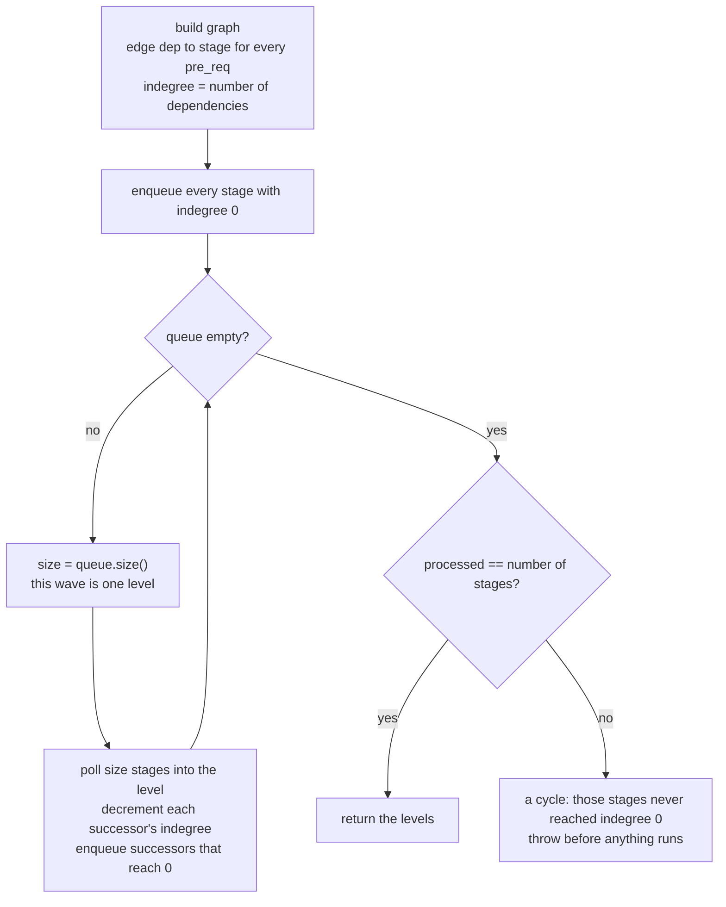
```mermaid
flowchart TD
    A["build graph<br/>edge dep to stage for every pre_req<br/>indegree = number of dependencies"] --> B["enqueue every stage with indegree 0"]
    B --> C{"queue empty?"}
    C -->|no| D["size = queue.size()<br/>this wave is one level"]
    D --> E["poll size stages into the level<br/>decrement each successor's indegree<br/>enqueue successors that reach 0"]
    E --> C
    C -->|yes| F{"processed == number of stages?"}
    F -->|yes| G["return the levels"]
    F -->|no| H["a cycle: those stages never reached indegree 0<br/>throw before anything runs"]
```

Every stage and every edge is touched once, so the sort is `O(V + E)`.

### Worked example: Black Friday

`pipeline_blackfriday.xml` has six stages. The two aggregations both depend
only on the filter, so they land in the same level and run concurrently. The
join depends on both, so its in-degree is 2, and it only becomes runnable after
both aggregations have finished.

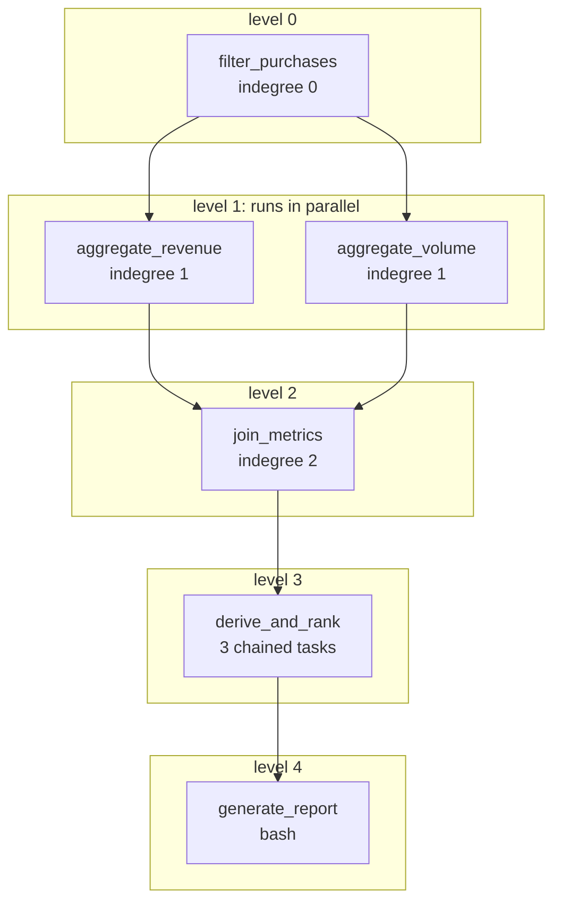
```mermaid
flowchart TB
    subgraph L0["level 0"]
        F["filter_purchases<br/>indegree 0"]
    end
    subgraph L1["level 1: runs in parallel"]
        R["aggregate_revenue<br/>indegree 1"]
        V["aggregate_volume<br/>indegree 1"]
    end
    subgraph L2["level 2"]
        J["join_metrics<br/>indegree 2"]
    end
    subgraph L3["level 3"]
        D["derive_and_rank<br/>3 chained tasks"]
    end
    subgraph L4["level 4"]
        G["generate_report<br/>bash"]
    end
    F --> R
    F --> V
    R --> J
    V --> J
    J --> D
    D --> G
```

In the XML, all of that parallelism comes from two attributes:

```xml
<stage id="aggregate_revenue" pre_req="filter_purchases"> ... </stage>
<stage id="aggregate_volume"  pre_req="filter_purchases"> ... </stage>
<stage id="join_metrics"      pre_req="aggregate_revenue aggregate_volume"> ... </stage>
```

### Why Kahn's and not a DFS sort

Both produce a valid topological order. A depth-first sort produces a single
linear order and says nothing about which stages could run together. Kahn's
breadth-first waves are exactly the groups of mutually independent stages, so
its output drops straight into a parallel executor. Cycle detection comes free
with it: a stage on a cycle never reaches in-degree 0, so fewer stages are
processed than exist.

---

## Execution

### One run, end to end

`PipelineExecutor.execute()` is the scheduler. Its core, with setup trimmed:

```java
List<List<Stage>> levels = job.getExecutionLevels();
PipelineRun run = new PipelineRun(UUID.randomUUID().toString());
run.setXmlSnapshot(xmlSnapshot);
run.setStatus("RUNNING");
try {
    for (int level = 0; level < levels.size(); level++) {
        logger.info("STAGE_LEVEL_START level=" + level);
        levels.get(level)
              .parallelStream()
              .forEach(stage -> executeStage(stage, job.getDatasourceMap(), run));
    }
    run.setStatus("SUCCESS");
} catch (Exception e) {
    run.setStatus("FAILED");
    throw e;
} finally {
    run.setEndTime(System.currentTimeMillis());
    runManager.saveRun(run);                     // persisted on success and on failure
}
```

The outer `for` enforces the topological order: `forEach` on a parallel stream
does not return until every stage in the level has finished, so level `n + 1`
cannot start early. That terminal operation is the whole level barrier.

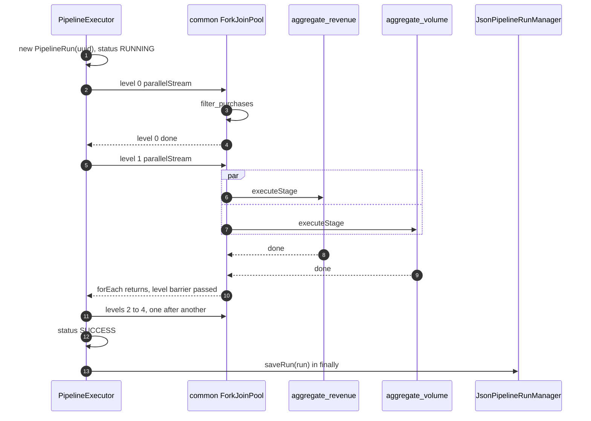
```mermaid
sequenceDiagram
    autonumber
    participant E as PipelineExecutor
    participant FJ as common ForkJoinPool
    participant S1 as aggregate_revenue
    participant S2 as aggregate_volume
    participant R as JsonPipelineRunManager
    E->>E: new PipelineRun(uuid), status RUNNING
    E->>FJ: level 0 parallelStream
    FJ->>FJ: filter_purchases
    FJ-->>E: level 0 done
    E->>FJ: level 1 parallelStream
    par
        FJ->>S1: executeStage
    and
        FJ->>S2: executeStage
    end
    S1-->>FJ: done
    S2-->>FJ: done
    FJ-->>E: forEach returns, level barrier passed
    E->>FJ: levels 2 to 4, one after another
    E->>E: status SUCCESS
    E->>R: saveRun(run) in finally
```

### Inside a stage

A stage runs its tasks strictly in order on one thread, inside a retry loop
driven by the stage's `on_error` policy:

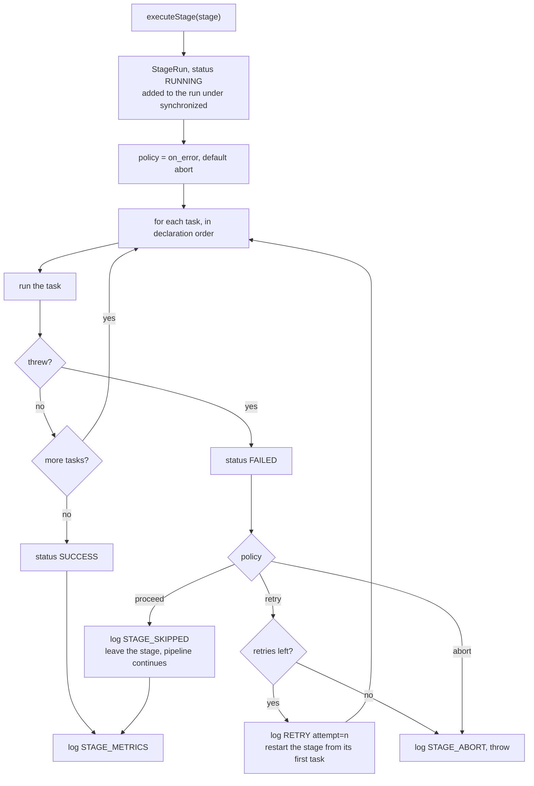
```mermaid
flowchart TD
    A["executeStage(stage)"] --> B["StageRun, status RUNNING<br/>added to the run under synchronized"]
    B --> C["policy = on_error, default abort"]
    C --> D["for each task, in declaration order"]
    D --> E["run the task"]
    E --> F{"threw?"}
    F -->|no| G{"more tasks?"}
    G -->|yes| D
    G -->|no| H["status SUCCESS"]
    F -->|yes| I["status FAILED"]
    I --> J{"policy"}
    J -->|proceed| K["log STAGE_SKIPPED<br/>leave the stage, pipeline continues"]
    J -->|retry| L{"retries left?"}
    L -->|yes| M["log RETRY attempt=n<br/>restart the stage from its first task"]
    M --> D
    L -->|no| N["log STAGE_ABORT, throw"]
    J -->|abort| N
    H --> O["log STAGE_METRICS"]
    K --> O
```

- **Retry is stage-scoped.** A failure in the third task restarts the stage
  from its first task. `retry_count="2"` allows up to three executions in
  total. There is no backoff between attempts.
- **Proceed** skips the failed stage and lets the pipeline continue. The stage
  is recorded as `FAILED`, and whatever its output file contained at the
  moment of failure is what downstream stages read.
- **Abort** wraps the cause in `RuntimeException("aborted due to error at
  stage <id>")`, which propagates out of the parallel stream and ends the run.

### Life of a task

This is the core of the engine: how one task becomes an iterator chain and how
the chain is drained.

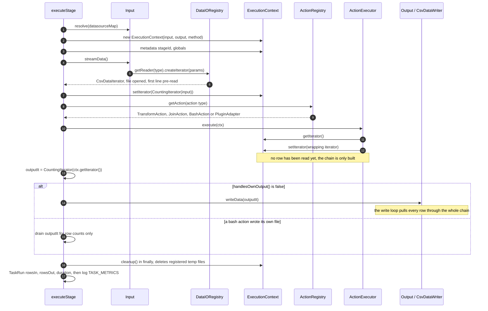
```mermaid
sequenceDiagram
    autonumber
    participant X as executeStage
    participant IN as Input
    participant IO as DataIORegistry
    participant C as ExecutionContext
    participant AR as ActionRegistry
    participant A as ActionExecutor
    participant OUT as Output / CsvDataWriter

    X->>IN: resolve(datasourceMap)
    X->>C: new ExecutionContext(input, output, method)
    X->>C: metadata stageId, globals
    X->>IN: streamData()
    IN->>IO: getReader(type).createIterator(params)
    IO-->>X: CsvDataIterator, file opened, first line pre-read
    X->>C: setIterator(CountingIterator(input))
    X->>AR: getAction(action type)
    AR-->>X: TransformAction, JoinAction, BashAction or PluginAdapter
    X->>A: execute(ctx)
    A->>C: getIterator()
    A->>C: setIterator(wrapping iterator)
    Note over A,C: no row has been read yet, the chain is only built
    X->>X: outputIt = CountingIterator(ctx.getIterator())
    alt handlesOwnOutput() is false
        X->>OUT: writeData(outputIt)
        Note over OUT: the write loop pulls every row through the whole chain
    else a bash action wrote its own file
        X->>X: drain outputIt for row counts only
    end
    X->>C: cleanup() in finally, deletes registered temp files
    X->>X: TaskRun rowsIn, rowsOut, duration, then log TASK_METRICS
```

`ExecutionContext` is the envelope a task carries:

| Field | Purpose |
|---|---|
| `input`, `output`, `method` | The task's resolved config; operators read their parameters from `method.getParamMap()` |
| `iterator` | The hand-off point. The executor puts the input iterator here; the action replaces it with its output iterator; the executor drains whatever is here |
| `metadata` | `stageId` and `globals` (the datasource map). `JoinAction` reads `globals` to resolve `right_ref` at run time |
| `tempFiles` | Paths registered by operators that spill to disk. `cleanup()` deletes them and always runs in the task's `finally` block |

A new context is created for every task and never shared between threads.

### Stage and run status

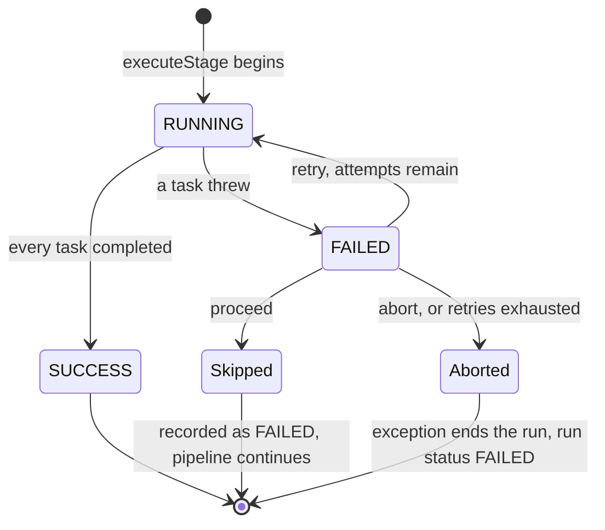
```mermaid
stateDiagram-v2
    [*] --> RUNNING: executeStage begins
    RUNNING --> SUCCESS: every task completed
    RUNNING --> FAILED: a task threw
    FAILED --> RUNNING: retry, attempts remain
    FAILED --> Skipped: proceed
    FAILED --> Aborted: abort, or retries exhausted
    SUCCESS --> [*]
    Skipped --> [*]: recorded as FAILED, pipeline continues
    Aborted --> [*]: exception ends the run, run status FAILED
```

---

## The streaming model

### The DataIterator contract

Every row that moves through the engine moves through this interface:

```java
public interface DataIterator extends AutoCloseable {
    boolean hasNext();     // may pre-fetch, must be idempotent
    String[] next();       // the first row is always the header
    default void close() {}
}
```

Readers produce one (`CsvDataIterator`, `ApiDataIterator`), every operator
consumes one and returns one, and the writer drains one. Because the interface
hides where rows come from, an operator cannot tell a CSV file from an HTTP
response from a k-way merge over spill files.

### Pull, don't push

A transform does no work when it is applied. `TransformAction.execute()` is
three lines:

```java
DataIterator input  = ctx.getIterator();
DataIterator output = strategy.apply(input, method);   // wraps input, reads nothing
ctx.setIterator(output);
```

`apply()` returns an anonymous iterator that holds a reference to its
upstream. A chain of `filter`, `map` and `derive` is therefore three nested
iterators that have not read a byte. Work starts only when the writer calls
`next()`, and each call cascades back up the chain to one `readLine()`:

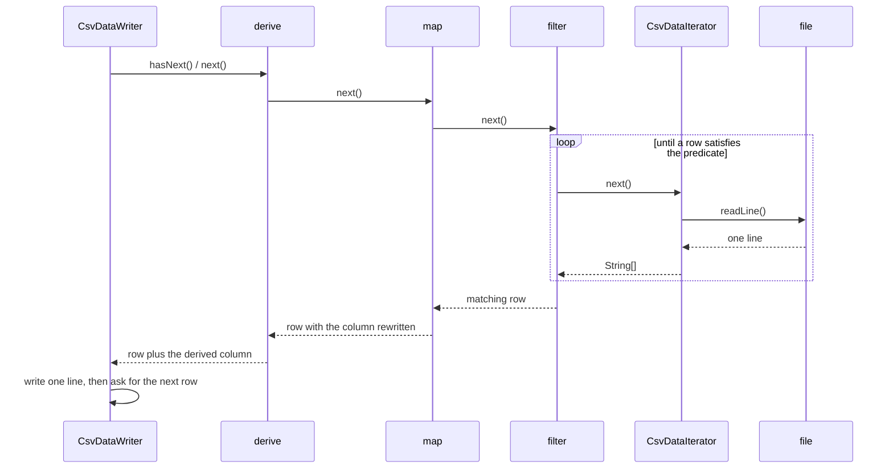
```mermaid
sequenceDiagram
    participant W as CsvDataWriter
    participant D as derive
    participant M as map
    participant F as filter
    participant R as CsvDataIterator
    participant K as file

    W->>D: hasNext() / next()
    D->>M: next()
    M->>F: next()
    loop until a row satisfies the predicate
        F->>R: next()
        R->>K: readLine()
        K-->>R: one line
        R-->>F: String[]
    end
    F-->>M: matching row
    M-->>D: row with the column rewritten
    D-->>W: row plus the derived column
    W->>W: write one line, then ask for the next row
```

The consequences:

- **Constant memory for row-local chains.** At any moment the chain holds the
  row in flight, not the file. This is why a filter can stream all 67.5
  million rows of the sample dataset without ever loading the file.
- **Back-pressure for free.** Nothing is produced faster than it is consumed.
  A slow write simply throttles reading.
- **One pass over the source.** `hasNext()` is idempotent in every operator:
  those that scan ahead (`filter`, `drop_nulls`, `select`) buffer exactly one
  row, so calling `hasNext()` repeatedly never skips or duplicates a row. A
  test drives each of them with redundant `hasNext()` calls and asserts the
  source's `next()` was called exactly once per row.

This is the Volcano, or iterator, execution model that relational databases
use: every operator implements the same interface and composes by pulling
from its child.

### The header contract

Rows are positional `String[]`, and no schema travels beside them. Instead,
the first row every iterator returns is the header, and every operator
discovers its column indices by reading it. An operator that adds, removes or
renames columns must rewrite the header it emits so that the next operator
sees the right schema.

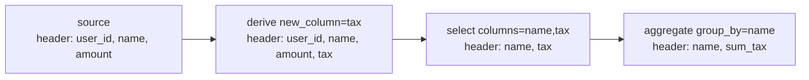
```mermaid
flowchart LR
    A["source<br/>header: user_id, name, amount"] --> B["derive new_column=tax<br/>header: user_id, name, amount, tax"]
    B --> C["select columns=name,tax<br/>header: name, tax"]
    C --> D["aggregate group_by=name<br/>header: name, sum_tax"]
```

`CsvDataIterator` itself knows nothing about headers: line 1 is simply the
first line. The contract lives entirely in the operators, which is what makes
them composable in any order.

### Streaming and blocking operators

Not every operator can stream. An operator that must see every row before it
can emit the first one has to hold state, and how much state is exactly its
memory cost:

| Operator | Kind | Holds in memory |
|---|---|---|
| `filter`, `select`, `map`, `derive`, `fill_nulls`, `drop_nulls` | streaming | one row |
| `limit` | streaming | a counter |
| hash join, probe side | streaming | one left row; the right side is built up front |
| `aggregate` | blocking | one accumulator per distinct group key |
| `max` | blocking | one number |
| `sort` | blocking | every row |
| `normalize` | blocking | every row, to apply a global min and max |
| `scale` | blocking | every row, to apply a global mean and standard deviation |
| sort-merge join | blocking | one 50,000-row chunk while sorting, then one row per run |

The example pipelines put the blocking operators late, after aggregation has
reduced millions of rows to hundreds, so the operators that buffer only ever
see small inputs.

### Counting rows without touching them

`CountingIterator` is a transparent decorator: it delegates `hasNext()` and
`close()` unchanged and increments a counter in `next()`. The executor wraps
the input with one and the action's output with another, and gets `rowsIn` and
`rowsOut` for every task without any operator knowing about metrics.

```java
public String[] next() {
    String[] row = inner.next();
    count++;
    return row;
}
```

Both counts include the header row, so the join task in the tour above reports
`rowsIn=6` (header plus 5 users) and `rowsOut=10` (header plus 9 joined rows).

---

## Operators

### Dispatch through a strategy registry

`transform` actions are dispatched by method name to one of 12
`TransformStrategy` implementations held in a map:

```java
public TransformAction() {
    methods.put("filter",     new FilterStrategy());
    methods.put("select",     new SelectStrategy());
    methods.put("map",        new MapStrategy());
    methods.put("aggregate",  new AggregateStrategy());
    methods.put("derive",     new DeriveStrategy());
    methods.put("drop_nulls", new DropNullsStrategy());
    methods.put("fill_nulls", new FillNullsStrategy());
    methods.put("sort",       new SortStrategy());
    methods.put("limit",      new LimitStrategy());
    methods.put("normalize",  new NormalizeStrategy());
    methods.put("scale",      new ScaleStrategy());
    methods.put("max",        new MaxStrategy());
}
```

```java
public interface TransformStrategy {
    DataIterator apply(DataIterator input, Method method);
}
```

Strategy instances are shared by every task and every thread, so they are
stateless: all per-execution state (the header, the column index, the
look-ahead row) lives inside the anonymous iterator that `apply()` returns.

The iterators they return are decorators. Each wraps the upstream iterator
behind the same interface and adds one behavior, so `filter`, then `map`, then
`derive` is a stack of decorators over a common iterator contract.

### Row-local operators

| Operator | What happens to each row |
|---|---|
| `filter` | Kept if the predicate holds. When both the cell and the value parse as numbers the comparison is numeric (`=`, `>`, `<`, `>=`, `<=`); otherwise it is string equality. `filter` scans ahead inside `hasNext()` and buffers the next matching row |
| `select` | Projected to the listed columns, in the listed order. The emitted header is the list itself |
| `map` | One numeric column rewritten in place: `add`, `subtract`, `multiply` or `divide` by a constant. The row is cloned first, so upstream arrays are never mutated |
| `derive` | One column appended, computed from a formula over the row's own columns |
| `fill_nulls` | An empty or whitespace-only cell in one column replaced with a constant |
| `drop_nulls` | Dropped if any listed column is missing, empty or whitespace-only |
| `limit` | Passed through until `count` data rows have been emitted; the header does not count |

### The derive formula engine

`derive` evaluates arithmetic formulas such as `sum_price / right_count_product_id`
or `(price - cost) * qty` against each row. It is a small expression
interpreter in three steps:

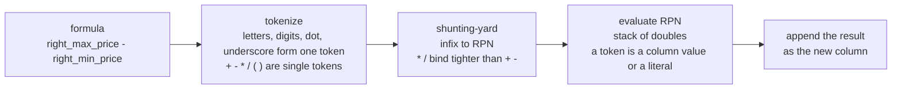
```mermaid
flowchart LR
    A["formula<br/>right_max_price - right_min_price"] --> B["tokenize<br/>letters, digits, dot, underscore form one token<br/>+ - * / ( ) are single tokens"]
    B --> C["shunting-yard<br/>infix to RPN<br/>* / bind tighter than + -"]
    C --> D["evaluate RPN<br/>stack of doubles<br/>a token is a column value or a literal"]
    D --> E["append the result<br/>as the new column"]
```

For `(price - cost) * qty`:

```text
tokens : (  price  -  cost  )  *  qty
RPN    : price  cost  -  qty  *
stack  : [price]  [price, cost]  [price-cost]  [price-cost, qty]  [(price-cost)*qty]
```

- Underscores are identifier characters, so join-produced names such as
  `right_count_product_id` are single tokens.
- A token is looked up as a column name first, then parsed as a number.
- A formula that fails to evaluate leaves the new cell empty rather than
  aborting the pipeline. Division by zero follows IEEE 754 and yields
  `Infinity` or `NaN`.

### Aggregation

`aggregate` computes `sum`, `avg`, `min`, `max` or `count` of one column per
distinct value of a `group_by` column. It consumes its input in 1,000-row
chunks, aggregates each chunk into a local map, and merges that map into a
global one, a map-and-reduce shape inside a single operator:

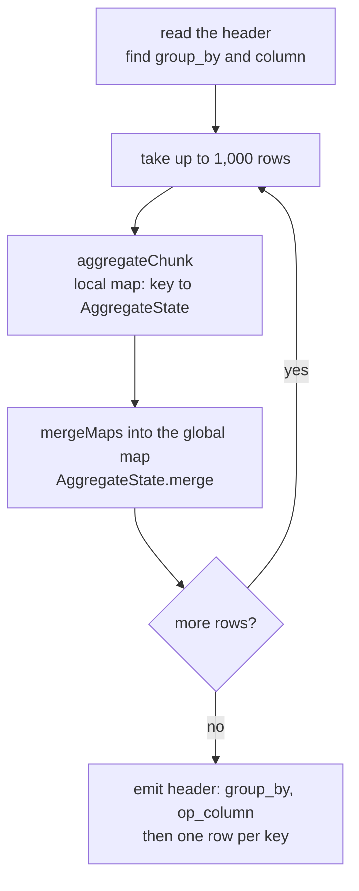
```mermaid
flowchart TD
    A["read the header<br/>find group_by and column"] --> B["take up to 1,000 rows"]
    B --> C["aggregateChunk<br/>local map: key to AggregateState"]
    C --> D["mergeMaps into the global map<br/>AggregateState.merge"]
    D --> E{"more rows?"}
    E -->|yes| B
    E -->|no| F["emit header: group_by, op_column<br/>then one row per key"]
```

The per-key state is a small mergeable record:

```java
static class AggregateState {
    double sum = 0.0;
    int rowCount = 0;       // every row in the group
    int valueCount = 0;     // rows whose value parsed as a number
    double min = Double.MAX_VALUE;
    double max = Double.NEGATIVE_INFINITY;

    void merge(AggregateState other) {
        sum += other.sum;
        rowCount += other.rowCount;
        valueCount += other.valueCount;
        min = Math.min(min, other.min);
        max = Math.max(max, other.max);
    }
}
```

Every field merges associatively, which is what lets partial results from
separate chunks combine into the exact global answer. `avg` is `sum /
valueCount`; `count` is `rowCount`, so it counts every row in the group
whether or not its value is numeric. A blank group key is folded into the key
`UNKNOWN`. Memory is one `AggregateState` per distinct key, regardless of how
many rows there are.

### Global operators

These need a property of the whole dataset before they can emit anything:

| Operator | How |
|---|---|
| `sort` | Buffers every row, then sorts by the column. Each comparison is numeric when both values parse as numbers and lexicographic otherwise |
| `normalize` | Buffers every row while tracking min and max, then rewrites the column as `(v - min) / (max - min)`, or 0 when all values are equal |
| `scale` | Buffers every row while summing, computes the population standard deviation in a second pass over the buffer, then rewrites the column as `(v - mean) / σ`, or 0 when `σ = 0` |
| `max` | Reads the whole input once, keeping only the running maximum, then emits a one-column, one-row result `max_<column>`, or `NaN` if no value was numeric |

`sort`, `normalize` and `scale` stream the header immediately and buffer only
when the first data row is requested.

### Operator reference

| Method | Required parameters | Output header | Memory | Unknown column |
|---|---|---|---|---|
| `filter` | `column`, `operator`, `value` | unchanged | one row | throws |
| `select` | `columns` (comma-separated) | the listed columns | one row | throws |
| `map` | `column`, `operation`, `value` | unchanged | one row | throws |
| `derive` | `new_column`, `formula` | input plus `new_column` | one row | a missing name evaluates as 0 |
| `fill_nulls` | `column`, `value` | unchanged | one row | no-op |
| `drop_nulls` | `columns` (comma-separated) | unchanged | one row | throws |
| `limit` | `count` | unchanged | a counter | not applicable |
| `aggregate` | `group_by`, `column`, `operation` | `group_by`, `<operation>_<column>` | one state per group | throws |
| `max` | `column` | `max_<column>` | one number | throws |
| `sort` | `column`, `order` (`asc` or `desc`) | unchanged | all rows | rows pass through unsorted |
| `normalize` | `column` | unchanged | all rows | rows pass through unchanged |
| `scale` | `column` | unchanged | all rows | rows pass through unchanged |

---

## Joins

A join combines the task's input (the left side) with a second dataset (the
right side) on a key column:

```xml
<action type="join">
  <method name="inner">
    <param name="left_key"      value="user_id"/>
    <param name="right_key"     value="user_id"/>
    <param name="right_ref"     value="ds_orders"/>  <!-- or right_src with a CSV path -->
    <param name="join_type"     value="left"/>       <!-- inner (default), left, right, full -->
    <param name="join_strategy" value="hash"/>       <!-- hash (default) or sort_merge -->
  </method>
</action>
```

The join type is read from the `join_type` parameter, which defaults to
`inner`. The `<method name>` is not consulted by `JoinAction`, so
`<method name="left">` on its own still performs an inner join; set
`join_type` to get an outer join.

### Output schema

The output header is the full left header, followed by every right column
except the right key, each prefixed with `right_`:

```text
left     [user_id, name, country]
right    [order_id, user_id, amount, category]        key: user_id
output   [user_id, name, country, right_order_id, right_amount, right_category]
```

The prefix keeps chained joins unambiguous. The CEP fraud pipeline builds a
session profile from four joins in a row:

```text
join 1   [user_session, count_product_id, right_sum_price]
join 2   [user_session, count_product_id, right_sum_price, right_avg_price]
join 3   [user_session, count_product_id, right_sum_price, right_avg_price, right_max_price]
join 4   [user_session, count_product_id, right_sum_price, right_avg_price, right_max_price, right_min_price]
```

### Hash join

The default strategy. The right side is loaded into a hash map in a build
phase; the left side is then streamed through it in a probe phase that is,
like every other operator, a lazy iterator.

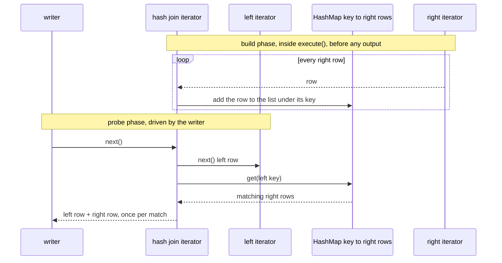
```mermaid
sequenceDiagram
    participant W as writer
    participant J as hash join iterator
    participant L as left iterator
    participant H as HashMap key to right rows
    participant R as right iterator

    Note over J,R: build phase, inside execute(), before any output
    loop every right row
        R-->>J: row
        J->>H: add the row to the list under its key
    end
    Note over W,L: probe phase, driven by the writer
    W->>J: next()
    J->>L: next() left row
    J->>H: get(left key)
    H-->>J: matching right rows
    J-->>W: left row + right row, once per match
```

| | |
|---|---|
| Time | `O(L + R)` |
| Memory | `O(R)`: the whole right side lives in the map |
| Duplicate keys | Each left row is emitted once per matching right row, so M × N matches produce M × N rows |
| `left`, `full` | A left row with no match is emitted with empty right columns |
| `right`, `full` | Every right row is tracked in an `IdentityHashMap`; after the left side is exhausted, the right rows never matched are emitted with empty left columns |

### Sort-merge join with external sort

For a right side too large for a hash map. Both sides are sorted by their key
with an external merge sort, then walked in lockstep:

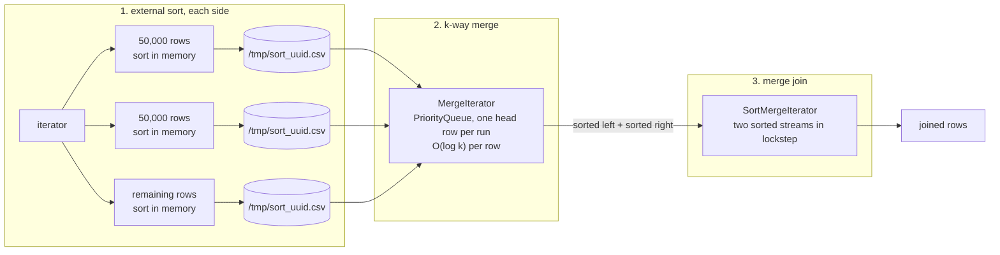
```mermaid
flowchart LR
    subgraph P1["1. external sort, each side"]
        direction TB
        IN["iterator"] --> C1["50,000 rows<br/>sort in memory"]
        IN --> C2["50,000 rows<br/>sort in memory"]
        IN --> C3["remaining rows<br/>sort in memory"]
        C1 --> F1[("/tmp/sort_uuid.csv")]
        C2 --> F2[("/tmp/sort_uuid.csv")]
        C3 --> F3[("/tmp/sort_uuid.csv")]
    end
    subgraph P2["2. k-way merge"]
        PQ["MergeIterator<br/>PriorityQueue, one head row per run<br/>O(log k) per row"]
    end
    subgraph P3["3. merge join"]
        SM["SortMergeIterator<br/>two sorted streams in lockstep"]
    end
    F1 --> PQ
    F2 --> PQ
    F3 --> PQ
    PQ -->|"sorted left + sorted right"| SM
    SM --> OUT["joined rows"]
```

1. **Run generation.** `externalSortFromIterator()` reads the input in chunks
   of 50,000 rows, sorts each chunk in memory, and writes it to its own temp
   file. Each file is registered with the context for deletion.
2. **K-way merge.** `MergeIterator` opens every run, puts the first row of
   each into a `PriorityQueue`, and on every `next()` pops the smallest row and
   pushes that run's next row in its place. The output is one globally sorted
   stream, holding one row per run.
3. **Merge join.** `SortMergeIterator` compares the current left and right
   keys. The smaller side advances; on equal keys it gathers the run of equal
   keys from both sides and emits their cross product.

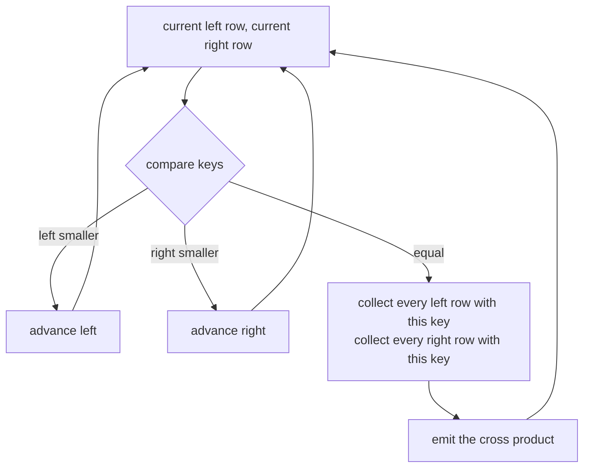
```mermaid
flowchart TD
    A["current left row, current right row"] --> B{"compare keys"}
    B -->|"left smaller"| C["advance left"]
    B -->|"right smaller"| D["advance right"]
    B -->|equal| E["collect every left row with this key<br/>collect every right row with this key"]
    E --> F["emit the cross product"]
    C --> A
    D --> A
    F --> A
```

| | |
|---|---|
| Time | `O(n log n)` for the sorts, then one linear merge |
| Memory | one 50,000-row chunk while sorting; one row per run while merging; the rows of a single key while emitting it |
| Join types | `inner` only. Outer joins through a two-pointer merge would need to track unmatched rows across the advance; the validator rejects `sort_merge` with any other type before execution |
| Key order | Numeric when both keys parse as numbers, lexicographic otherwise |

Both strategies wrap their output in a `CleanupIterator`, a decorator that
calls `ctx.cleanup()` as soon as the stream is exhausted or `next()` throws,
so run files are deleted without waiting for the task to end. The task's own
`finally` block calls `cleanup()` again as a backstop; it is idempotent.

### Choosing a strategy

The strategy is not picked automatically. It comes from `join_strategy`,
which defaults to `hash`:

| Right side | Join type | Use |
|---|---|---|
| fits in memory | any | `hash` |
| does not fit | `inner` | `sort_merge` |
| does not fit | outer | not supported; reduce the right side first, e.g. by aggregating it |

---

## Bash actions

A `bash` action runs a shell script as a task, which is how the example
pipelines render their final reports:

```xml
<action type="bash">
  <method name="run">
    <param name="script" value="src/main/resources/scripts/leaderboard.sh"/>
    <param name="arg1"   value="normal"/>       <!-- optional extra arguments -->
  </method>
</action>
```

`BashAction` builds the command line from the task's resolved paths and runs it
with `ProcessBuilder`:

```text
bash <script> <input src> [arg1 arg2 ...] [output src]
```

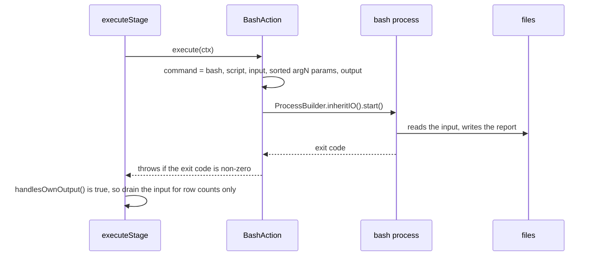
```mermaid
sequenceDiagram
    participant X as executeStage
    participant B as BashAction
    participant P as bash process
    participant F as files
    X->>B: execute(ctx)
    B->>B: command = bash, script, input, sorted argN params, output
    B->>P: ProcessBuilder.inheritIO().start()
    P->>F: reads the input, writes the report
    P-->>B: exit code
    B-->>X: throws if the exit code is non-zero
    X->>X: handlesOwnOutput() is true, so drain the input for row counts only
```

- `inheritIO()` connects the script's stdout and stderr to the JVM's, so a
  report's colored output appears live in the terminal.
- `argN` parameters are appended in lexicographic order of their names
  (`arg1`, `arg10`, `arg2`), so zero-pad them past nine.
- The script writes the output file itself, so `BashAction` overrides
  `handlesOwnOutput()` to return `true`. Without that flag, the executor would
  write the unconsumed input rows over the file the script had just produced.

---

## Plugins

New action types can be added without editing the engine. A plugin implements
a small SPI and lists itself in a `ServiceLoader` provider file:

```java
public interface ActionPlugin {
    String getType();            // the action type used in XML
    String getName();
    Executor getExecutor();      // the operation itself
}

@FunctionalInterface
public interface Executor {
    DataIterator execute(ExecutionContext context);
}
```

```text
src/main/resources/META-INF/services/org.example.datapipeline.plugin.ActionPlugin
org.example.datapipeline.onboarding.AssignRollNumberPlugin
org.example.datapipeline.onboarding.GenerateEmailIdPlugin
org.example.datapipeline.onboarding.HttpRequestPlugin
org.example.datapipeline.onboarding.GeneratePdfPlugin
```

`ActionRegistry` registers the three built-in executors and then asks
`ServiceLoader` for every plugin on the classpath, wrapping each in a
`PluginAdapter` that bridges the plugin SPI to the engine's `ActionExecutor`
interface:

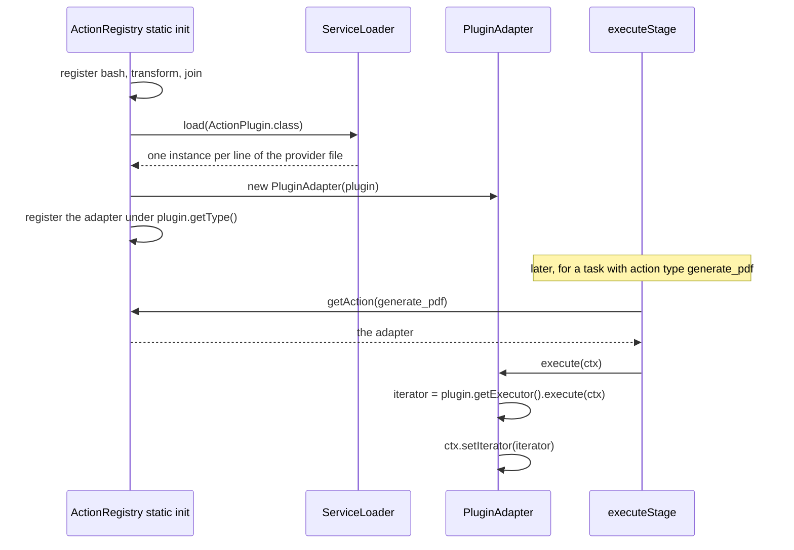
```mermaid
sequenceDiagram
    participant C as ActionRegistry static init
    participant SL as ServiceLoader
    participant PA as PluginAdapter
    participant X as executeStage
    C->>C: register bash, transform, join
    C->>SL: load(ActionPlugin.class)
    SL-->>C: one instance per line of the provider file
    C->>PA: new PluginAdapter(plugin)
    C->>C: register the adapter under plugin.getType()
    Note over X: later, for a task with action type generate_pdf
    X->>C: getAction(generate_pdf)
    C-->>X: the adapter
    X->>PA: execute(ctx)
    PA->>PA: iterator = plugin.getExecutor().execute(ctx)
    PA->>PA: ctx.setIterator(iterator)
```

Registration is by type string, and a later registration replaces an earlier
one, so a plugin can also override a built-in action.

Four plugins ship with the project and are used by `pipeline_onboarding.xml`,
which provisions credentials for a list of students in one five-task stage:

```mermaid
flowchart LR
    A["Reporting_Students.csv<br/>name, personal_email, department, year"] --> B["assign_roll_number<br/>+ roll_number"]
    B --> C["generate_email_id<br/>+ institute_email"]
    C --> D["http_request prefix github<br/>+ github_id, github_username,<br/>github_status, github_error"]
    D --> E["http_request prefix leetcode<br/>+ leetcode_id, leetcode_username,<br/>leetcode_status, leetcode_error"]
    E --> F["generate_pdf<br/>one credentials file per student<br/>+ pdf_status, pdf_path"]
```

| Plugin type | Parameters | Adds |
|---|---|---|
| `assign_roll_number` | `format` with `{year}`, `{dept_code}`, `{counter}` or `{counter:N}`; `year`; `dept_code_map` such as `CSE:CS,ECE:EE`; `strict_dept_mapping` | `roll_number`, numbered per department |
| `generate_email_id` | `domain` (default `college.edu`) | `institute_email`: `first.last.<roll>@<domain>`, suffixed `_1`, `_2` on collision |
| `http_request` | `url`, `method`, `output_prefix`, `response_mapping` (`column:json.path`), `body_template`, `headers_json`, `strict_mapping`, `mock_mode`, `timeout_ms` (3000), `retry_count` (2), `max_qps` | one column per mapping, `<prefix>_status`, `<prefix>_error`. 5xx responses are retried with backoff; a failed row is marked `FAILED` and processing continues |
| `generate_pdf` | `output_dir`, `fields` (`Label:column,...`), `file_name_template` such as `{roll_number}_credentials.txt` | writes one text document per row; adds `pdf_status`, `pdf_path` |

---

## I/O

Readers and writers live in `DataIORegistry`, keyed by the `type` of an input,
output or datasource:

```mermaid
flowchart LR
    I["input type"] --> RG["DataIORegistry"]
    O["output type"] --> RG
    RG -->|"csv"| CR["CsvDataReader<br/>param src"]
    RG -->|"api"| AR["ApiDataReader<br/>params url, json_path, fields"]
    RG -->|"csv"| CW["CsvDataWriter<br/>param src"]
    CR --> CI["CsvDataIterator"]
    AR --> AI["ApiDataIterator"]
```

| Type | Direction | Behavior |
|---|---|---|
| `csv` | read | `BufferedReader` over a UTF-8 stream. Pre-reads one line so `hasNext()` is exact; splits each line on commas; closes the file itself at end of input |
| `csv` | write | Creates parent directories, writes each row as a comma-joined line, logs `ROWS_WRITTEN count=<n> file=<src>` |
| `api` | read | One HTTP GET, parses the JSON body, takes the array under the top-level key `json_path`, and emits the listed `fields` as columns. The header is the `fields` list |

The CSV format is deliberately minimal: fields are split on every comma, with
no quoting. See [Known limitations](#known-limitations).

---

## Concurrency model

There are three places work can happen at once, and one rule that keeps them
safe:

```mermaid
flowchart TB
    subgraph MAIN["main thread"]
        EX["PipelineExecutor.execute()<br/>loops over levels"]
    end
    subgraph POOL["ForkJoinPool.commonPool()"]
        direction LR
        T1["worker<br/>stage A, its tasks in order"]
        T2["worker<br/>stage B, its tasks in order"]
        T3["worker<br/>stage C, its tasks in order"]
    end
    subgraph PROC["child processes"]
        BS["bash scripts<br/>one per bash task, waited on"]
    end
    EX -->|"parallelStream per level"| POOL
    T1 --> BS
    RUN["PipelineRun<br/>the only shared mutable object"]
    T1 -.->|"addStage under synchronized"| RUN
    T2 -.->|"addStage under synchronized"| RUN
    T3 -.->|"addStage under synchronized"| RUN
```

- **Parallelism is per stage.** The stages of one level run concurrently on
  the common pool; the tasks inside a stage run sequentially on that stage's
  thread. No single file is ever split across threads.
- **Isolation instead of locks.** Each stage gets its own `ExecutionContext`
  per task, its own iterators and its own output files. Nothing on the data
  path is shared, so nothing on it is locked.
- **What is shared, and how:**

| Shared thing | Safe because |
|---|---|
| `PipelineRun` | `addStage` is called inside `synchronized (pipelineRun)`; each `StageRun` is written only by its own stage's thread |
| `ActionRegistry`, `DataIORegistry` | Populated once in static initializers; only read during execution |
| Strategy and action instances | Stateless: all per-task state lives in the iterators they return |
| The datasource map | Built before the first level starts; only read afterwards |
| `AssignRollNumberPlugin` counters | A `ConcurrentHashMap` of `AtomicInteger`s; the plugin instance, and so its counters, lives for the whole JVM |

The parallel stream uses the JVM-wide common pool, whose size is the number
of available processors minus one, plus the calling thread.

---

## Failure handling

Each stage declares its own policy, so risk tolerance is part of the pipeline
definition:

```xml
<stage id="window_max_tx" pre_req="cleanse_stream">
    <on_error handling_strategy="retry" retry_count="2"/>
    ...
</stage>
<stage id="window_min_tx" pre_req="cleanse_stream">
    <on_error handling_strategy="proceed"/>
    ...
</stage>
```

| Policy | On a task failure | Typical use |
|---|---|---|
| `abort` (default) | Stage `FAILED`, exception propagates, run `FAILED` | The stage is load-bearing |
| `retry` + `retry_count` | The whole stage re-runs from its first task, up to `retry_count` more times, then aborts | Transient failures on a critical stage |
| `proceed` | Stage `FAILED` and skipped; later levels run | Supplementary output the pipeline can live without |

The CEP fraud pipeline uses both on sibling stages: the maximum-transaction
signal feeds two later signals, so it retries twice; the minimum-transaction
signal is supplementary, so it proceeds.

For transform and join tasks, re-running a stage is safe: `CsvDataWriter`
truncates its target when it opens it, so an attempt rewrites its outputs
rather than appending to them, and running the stage twice leaves the same
files as running it once. Tasks with effects outside their output file are
only as repeatable as those effects: a bash script or a non-mock
`http_request` runs again on every attempt, and `assign_roll_number` keeps
counting across attempts.

Temporary files cannot outlive a task. Operators register them with the
context, and `cleanup()` runs in the task's `finally` block whether the task
succeeded or threw.

---

## Run history and replay

Every run is recorded. The executor creates a `PipelineRun` with a random
UUID, stores the raw XML text in it, appends a `StageRun` per stage and a
`TaskRun` per task execution, and saves the record in its `finally` block, so a
failed run is recorded too.

```mermaid
sequenceDiagram
    participant P as Pipeline.run
    participant E as PipelineExecutor
    participant M as JsonPipelineRunManager
    participant D as runs/
    participant R as ReplayService
    P->>E: execute(job, xml text)
    E->>E: run = PipelineRun(uuid), xmlSnapshot = xml text
    E->>E: StageRun and TaskRun records as stages execute
    E->>M: saveRun(run) in finally
    M->>D: runs/uuid.json
    Note over R,D: later: --replay uuid
    R->>M: getRun(uuid)
    M->>D: read runs/uuid.json
    R->>R: write xmlSnapshot to a temp file
    R->>P: run(temp file), a new run with a new uuid
```

The record from the tour run, with the XML snapshot and the last two stages
cut. Keys appear in whatever order `org.json` emits them:

```json
{
  "xmlSnapshot": "<?xml version=\"1.0\" encoding=\"UTF-8\"?>\n< ... \n\n</job>",
  "stages": [
    {
      "startTime": 1790707593235,
      "endTime": 1790707593268,
      "tasks": [
        { "duration": 32, "rowsIn": 6, "success": true, "rowsOut": 10, "taskId": "join" }
      ],
      "stageId": "join_stage",
      "status": "SUCCESS"
    },
    {
      "startTime": 1790707593268,
      "endTime": 1790707593268,
      "tasks": [
        { "duration": 0, "rowsIn": 10, "success": true, "rowsOut": 10, "taskId": "transform" }
      ],
      "stageId": "clean_stage",
      "status": "SUCCESS"
    }
  ],
  "startTime": 1790707593235,
  "runId": "480f6e2a-88f5-4ea7-a577-d1180bd2cbd4",
  "endTime": 1790707593271,
  "status": "SUCCESS"
}
```

Note the `taskId`: tasks have no identity of their own, so a record names each
task by its action type.

Replay re-executes the exact pipeline definition that ran, against whatever
data is at those paths now. It reproduces the configuration, not the data.

---

## Logging and metrics

`LoggingConfig` installs two handlers on the root `java.util.logging` logger:

| Handler | Format | Where |
|---|---|---|
| Console | `[HH:mm:ss][LEVEL] message`, green, yellow or red by level | stderr |
| File | one JSON object per line: `level`, `logger`, `message` | `logs/pipeline.log`, appended |

The execution path logs structured `key=value` events:

| Event | Emitted |
|---|---|
| `PIPELINE_START file=...` | before parsing |
| `PIPELINE_EXECUTION_START` | when the executor starts |
| `STAGE_LEVEL_START level=n` | before each level |
| `TASK_START stage=... input=... action=... method=... output=...` | before each task |
| `[JOIN] strategy=HASH_JOIN type=...`, `[JOIN][HASH] phase=build_complete entries=n`, `[JOIN_METRICS] strategy=... durationMs=...` | around each join; `entries` is the number of distinct right-side keys |
| `ROWS_WRITTEN count=n file=...` | after each CSV write, header included |
| `TASK_METRICS stage=... method=... duration=... rowsIn=... rowsOut=... success=... error=...` | after each task, success or not |
| `RETRY stage=... attempt=n` / `STAGE_SKIPPED stage=...` / `STAGE_ABORT stage=... error=...` | on failure, by policy |
| `STAGE_METRICS stage=... duration=... retries=n` | after each stage completes or is skipped |
| `PIPELINE_EXECUTION_END` / `PIPELINE_ERROR ...` | at the end |

The console log of the tour run, through its first two levels:

```text
[00:16:33][INFO] PIPELINE_START file=src/main/resources/pipeline_config/pipeline-join-aggregate-test.xml
[00:16:33][INFO] PIPELINE_EXECUTION_START
[00:16:33][INFO] STAGE_LEVEL_START level=0
[00:16:33][INFO] TASK_START stage=join_stage input=src/main/resources/input/users.csv action=join method=inner output=src/main/resources/output/join_output.csv
[00:16:33][INFO] [JOIN] strategy=HASH_JOIN type=inner
[00:16:33][INFO] [JOIN][HASH] phase=build_start type=inner
[00:16:33][INFO] [JOIN][HASH] phase=build_complete entries=5
[00:16:33][INFO] [JOIN_METRICS] strategy=hash durationMs=2
[00:16:33][INFO] ROWS_WRITTEN count=10 file=src/main/resources/output/join_output.csv
[00:16:33][INFO] TASK_METRICS stage=join_stage method=inner duration=32 rowsIn=6 rowsOut=10 success=true error=none
[00:16:33][INFO] STAGE_METRICS stage=join_stage duration=33 retries=0
[00:16:33][INFO] STAGE_LEVEL_START level=1
[00:16:33][INFO] TASK_START stage=clean_stage input=src/main/resources/output/join_output.csv action=transform method=drop_nulls output=src/main/resources/output/cleaned_join_output.csv
[00:16:33][INFO] ROWS_WRITTEN count=10 file=src/main/resources/output/cleaned_join_output.csv
[00:16:33][INFO] TASK_METRICS stage=clean_stage method=drop_nulls duration=0 rowsIn=10 rowsOut=10 success=true error=none
[00:16:33][INFO] STAGE_METRICS stage=clean_stage duration=0 retries=0
```

Two things to read off it. `JOIN_METRICS` reports 2 ms while the task took
32 ms: the join call only builds the hash map and returns a lazy iterator, and
the probe happens later, inside the write. And `rowsIn=6` counts only the left
side, header included; the right side is read by the join itself.

Pass `--debug` or `--warn` after the XML path to change the root log level.

---

## Class model (UML)

The configuration model, as JAXB builds it:

```mermaid
classDiagram
    class Job {
        -String id
        -List~Datasource~ datasources
        -List~Stage~ stages
        -Map stageMap
        -Map datasourceMap
        +resolveDatasources()
        +buildStageMap()
        +getExecutionLevels() List
    }
    class Datasource {
        -String id
        -String type
        -List~Param~ params
    }
    class Stage {
        -String id
        -String preReq
        -List~Task~ tasks
        -OnError onError
        -Set dependencies
        +normalizeDependencies()
    }
    class OnError {
        -String handlingStrategy
        -Integer retryCount
    }
    class Task {
        -Input input
        -Action action
        -Output output
    }
    class Input {
        -String type
        -String ref
        -List~Param~ params
        -Map resolvedParams
        +resolve(Map datasources)
        +streamData() DataIterator
        +getSrc() String
    }
    class Output {
        -String type
        -String ref
        -List~Param~ params
        -Map resolvedParams
        +resolve(Map datasources)
        +writeData(DataIterator it)
        +getSrc() String
    }
    class Action {
        -String type
        -Method method
    }
    class Method {
        -String name
        -List~Param~ params
        +getParamMap() Map
    }
    class Param {
        -String name
        -String value
    }
    Job "1" *-- "0..*" Datasource
    Job "1" *-- "1..*" Stage
    Stage "1" *-- "1..*" Task
    Stage "1" *-- "0..1" OnError
    Task *-- Input
    Task *-- Action
    Task *-- Output
    Action *-- Method
    Method "1" *-- "0..*" Param
    Datasource "1" *-- "0..*" Param
    Input ..> Datasource : ref resolves to
    Output ..> Datasource : ref resolves to
```

The execution core: the executor, the context, and the action hierarchy.

```mermaid
classDiagram
    class PipelineExecutor {
        +execute(Job job, String xmlSnapshot)$
        -executeStage(Stage stage, Map globals, PipelineRun run)$
    }
    class ExecutionContext {
        -Input input
        -Output output
        -Method method
        -Map metadata
        -List~String~ tempFiles
        -DataIterator iterator
        +getIterator() DataIterator
        +setIterator(DataIterator it)
        +registerTempFile(String path)
        +cleanup()
    }
    class ActionRegistry {
        -Map registry$
        +getAction(String type)$ ActionExecutor
    }
    class ActionExecutor {
        <<interface>>
        +execute(ExecutionContext ctx)
        +getType() String
        +handlesOwnOutput() boolean
    }
    class TransformAction {
        -Map methods
        +execute(ExecutionContext ctx)
    }
    class TransformStrategy {
        <<interface>>
        +apply(DataIterator input, Method method) DataIterator
    }
    class JoinAction {
        +execute(ExecutionContext ctx)
        -executeHashJoin() DataIterator
        -executeSortMergeJoin() DataIterator
        -externalSortFromIterator() List
    }
    class BashAction {
        +execute(ExecutionContext ctx)
        +handlesOwnOutput() boolean
    }
    class PluginAdapter {
        -ActionPlugin plugin
        +execute(ExecutionContext ctx)
    }
    class ActionPlugin {
        <<interface>>
        +getType() String
        +getName() String
        +getExecutor() Executor
    }
    class Executor {
        <<interface>>
        +execute(ExecutionContext ctx) DataIterator
    }
    class FilterStrategy
    class AggregateStrategy
    class DeriveStrategy
    class SortStrategy
    class OtherStrategies["8 more strategies"]

    PipelineExecutor ..> ExecutionContext : creates per task
    PipelineExecutor ..> ActionRegistry : looks up
    ActionRegistry o-- "3 + plugins" ActionExecutor
    ActionExecutor <|.. TransformAction
    ActionExecutor <|.. JoinAction
    ActionExecutor <|.. BashAction
    ActionExecutor <|.. PluginAdapter
    TransformAction o-- "12" TransformStrategy
    TransformStrategy <|.. FilterStrategy
    TransformStrategy <|.. AggregateStrategy
    TransformStrategy <|.. DeriveStrategy
    TransformStrategy <|.. SortStrategy
    TransformStrategy <|.. OtherStrategies
    PluginAdapter --> ActionPlugin : adapts
    ActionPlugin ..> Executor : provides
```

Readers, writers and the iterator family:

```mermaid
classDiagram
    class DataIterator {
        <<interface>>
        +hasNext() boolean
        +next() String[]
        +close()
    }
    class CsvDataIterator {
        -BufferedReader reader
        -String nextLine
    }
    class ApiDataIterator {
        -Iterator arrayIter
        -String[] fields
    }
    class CountingIterator {
        -DataIterator inner
        -long count
        +getCount() long
    }
    class MergeIterator {
        -PriorityQueue pq
        -List~DataIterator~ iterators
    }
    class SortMergeIterator {
        -DataIterator left
        -DataIterator right
        -Queue buffer
    }
    class CleanupIterator {
        -DataIterator delegate
        -ExecutionContext ctx
    }
    class DataIORegistry {
        -Map readerRegistry$
        -Map writerRegistry$
        +getReader(String type)$ DataReader
        +getWriter(String type)$ DataWriter
    }
    class DataReader {
        <<interface>>
        +getType() String
        +createIterator(Map params) DataIterator
    }
    class DataWriter {
        <<interface>>
        +getType() String
        +writeData(DataIterator it, Map params)
    }
    class CsvDataReader
    class ApiDataReader
    class CsvDataWriter

    DataIterator <|.. CsvDataIterator
    DataIterator <|.. ApiDataIterator
    DataIterator <|.. CountingIterator
    DataIterator <|.. MergeIterator
    DataIterator <|.. SortMergeIterator
    DataIterator <|.. CleanupIterator
    CountingIterator o-- DataIterator : decorates
    CleanupIterator o-- DataIterator : decorates
    MergeIterator o-- "k" DataIterator : merges runs
    SortMergeIterator o-- "2" DataIterator : left and right
    DataIORegistry o-- DataReader
    DataIORegistry o-- DataWriter
    DataReader <|.. CsvDataReader
    DataReader <|.. ApiDataReader
    DataWriter <|.. CsvDataWriter
    CsvDataReader ..> CsvDataIterator : creates
    ApiDataReader ..> ApiDataIterator : creates
```

Run history:

```mermaid
classDiagram
    class PipelineRunManager {
        <<interface>>
        +saveRun(PipelineRun run)
        +getRun(String runId) PipelineRun
        +listRuns() List
    }
    class JsonPipelineRunManager {
        -String storageDir
    }
    class PipelineRun {
        -String runId
        -String xmlSnapshot
        -long startTime
        -long endTime
        -String status
        -List~StageRun~ stages
    }
    class StageRun {
        -String stageId
        -long startTime
        -long endTime
        -String status
        -List~TaskRun~ tasks
    }
    class TaskRun {
        -String taskId
        -long rowsIn
        -long rowsOut
        -long duration
        -boolean success
        -String error
    }
    class ReplayService {
        +replay(String runId)$
    }
    PipelineRunManager <|.. JsonPipelineRunManager
    PipelineRun "1" *-- "0..*" StageRun
    StageRun "1" *-- "0..*" TaskRun
    JsonPipelineRunManager ..> PipelineRun : reads and writes
    ReplayService ..> PipelineRunManager : loads the snapshot
```

---

## Example pipelines

All configurations live in `src/main/resources/pipeline_config/`.

| File | Stages | Tasks | Shows | Needs |
|---|---:|---:|---|---|
| `pipeline-join-aggregate-test.xml` | 4 | 8 | hash join, `drop_nulls`, five aggregations, `max` | nothing, runs from a fresh clone |
| `pipeline_blackfriday.xml` | 6 | 8 | parallel aggregations, join, derive, sort, limit, bash report | `2019-Nov.csv` |
| `pipeline_cep_fraud.xml` | 15 | 24 | 5 parallel windows, 4 chained joins, scoring, rule filter, `retry` and `proceed` | `2019-Nov.csv` |
| `pipeline_brandscorecard.xml` | 15 | 22 | 11 of the 12 transforms (all but `max`), parallel aggregations, chained joins, bash report | `2019-Nov.csv` |
| `pipeline_onboarding.xml` | 1 | 5 | all four plugins, HTTP in mock mode | nothing |
| `pipeline_api.xml` | 1 | 1 | the `api` reader against `dummyjson.com` | network |
| `pipeline_etl.xml`, `pipeline_fraud.xml`, `pipeline_script.xml` | | | smaller demos | varies |
| `test_*.xml` | | | one feature each: filter, derive, fill and drop nulls, aggregates, retry, proceed | nothing |

The three large pipelines read the November 2019 file of the
[eCommerce behavior data from multi-category store](https://www.kaggle.com/datasets/mkechinov/ecommerce-behavior-data-from-multi-category-store)
dataset: 67.5 million events, about 8 GB. It is not in the repository;
download it and place it at `src/main/resources/input/2019-Nov.csv`.

### Black Friday revenue intelligence

```text
[1]  filter_purchases        67.5M events filtered to 916,940 purchases
[2a] aggregate_revenue  ─┐   sum(price)       by category_code
[2b] aggregate_volume   ─┴─  count(product_id) by category_code      (parallel)
[3]  join_metrics            revenue joined with volume on category_code
[4]  derive_and_rank         avg_order_value = sum_price / right_count_product_id
                             then sort by sum_price desc, then limit 10
[5]  generate_report         bash: leaderboard.sh writes report.txt
```

Top of the resulting leaderboard, from a run on the full file:

| Rank | Category | Revenue | Orders | Average order |
|---:|---|---:|---:|---:|
| 1 | electronics.smartphone | 177,821,661 | 382,647 | 464.71 |
| 2 | UNKNOWN | 29,880,506 | 234,218 | 127.58 |
| 3 | electronics.video.tv | 12,457,151 | 30,274 | 411.48 |

`UNKNOWN` is the aggregate's bucket for events with no category code.

### CEP-style fraud detection

The pipeline expresses a complex-event-processing rule with batch operators
only:

| CEP concept | Built from |
|---|---|
| Event stream | the 67.5M-row file, filtered to purchases |
| Session window | `aggregate` grouped by `user_session` |
| Pattern signals | five parallel aggregations per session: count, sum, avg, max, min |
| Signal correlation | four chained joins into one session profile |
| Composite signals | `derive`: `price_range = right_max_price - right_min_price`, `velocity_risk = count_product_id * right_avg_price` |
| Scoring | `normalize` to [0, 1], `scale` to a z-score, `map` × 100 |
| Rule | `filter` `count_product_id >= 3` |
| Alert queue | `sort` descending, `limit` 50 |
| Action | bash: `cep_fraud_alert.sh` renders the alert report |

```text
[L0]    ingest_stream        filter to purchase events
[L1]    cleanse_stream       fill_nulls ×2, drop_nulls, map (USD to EUR), select       5 tasks
[L2]    window_*             count / sum / avg / max (retry 2) / min (proceed)         5 stages in parallel
[L3-L6] correlate_*          four sequential joins build the session profile
[L7]    extract_patterns     derive price_range, derive velocity_risk                  2 tasks
[L8]    score_risk           normalize, scale, map ×100                                3 tasks
[L9]    evaluate_rules       filter count >= 3, sort desc, limit 50                    3 tasks
[L10]   trigger_alert        bash report
```

On the full file, 25,422 sessions matched the rule; the top 50 carried a
combined exposure of €677,408, and the highest-risk session held 76
transactions worth €76,067.

This is not real-time CEP. The event stream is a static file processed in one
run: there are no sliding or tumbling time windows, no out-of-order handling
and no sub-second latency. The CEP vocabulary describes the analytical shape
of the pipeline, not its runtime.

---

## Command line

```text
pipeline <pipeline.xml> [--debug|--warn]    run a pipeline
pipeline --replay <run_id>                  re-run a recorded pipeline from its XML snapshot
pipeline --list-runs                        list the run IDs in runs/
```

`pipeline` here stands for `org.example.datapipeline.Main`; see
[Build, run, test](#build-run-test) for the full invocation.

Run everything from the repository root: the XSD, `runs/` and `logs/` are
resolved against the working directory.

---

## Pipeline XML reference

```text
job (id)
├── datasources?
│   └── datasource* (id, type)               type: csv | api
│       └── param* (name, value)
└── stage+ (id, pre_req?)                     pre_req: space-separated stage IDs
    ├── on_error? (handling_strategy, retry_count?)
    └── task+
        ├── input  (ref? | type)              type: csv | api
        │   └── param* (name, value)
        ├── action (type)                     type: transform | join | bash | a plugin type
        │   └── method (name)
        │       └── param* (name, value)
        └── output (ref? | type)              type: csv
            └── param* (name, value)
```

| Attribute | Values |
|---|---|
| `on_error/@handling_strategy` | `abort` (default when `on_error` is absent), `retry`, `proceed` |
| `on_error/@retry_count` | non-negative integer, required with `retry`, forbidden otherwise |
| `action/@type` | `transform`, `join`, `bash`, `assign_roll_number`, `generate_email_id`, `http_request`, `generate_pdf` |
| `method/@name` for `transform` | `filter`, `select`, `map`, `derive`, `aggregate`, `fill_nulls`, `drop_nulls`, `sort`, `limit`, `normalize`, `scale`, `max` |
| `method/@name` for `bash` | `run` |
| CSV params | `src` |
| API params | `url`, `json_path`, `fields` |

Stage, datasource and job IDs are XSD `xs:ID`s and share one namespace, so
they must be unique across the whole document.

A minimal pipeline:

```xml
<?xml version="1.0" encoding="UTF-8"?>
<job id="my-pipeline">
  <datasources>
    <datasource id="raw" type="csv">
      <param name="src" value="src/main/resources/input/test_input.csv"/>
    </datasource>
  </datasources>

  <stage id="purchases">
    <task>
      <input ref="raw"/>
      <action type="transform">
        <method name="filter">
          <param name="column"   value="event_type"/>
          <param name="operator" value="="/>
          <param name="value"    value="purchase"/>
        </method>
      </action>
      <output type="csv">
        <param name="src" value="target/purchases.csv"/>
      </output>
    </task>
  </stage>

  <stage id="revenue_per_user" pre_req="purchases">
    <on_error handling_strategy="retry" retry_count="2"/>
    <task>
      <input type="csv">
        <param name="src" value="target/purchases.csv"/>
      </input>
      <action type="transform">
        <method name="aggregate">
          <param name="group_by"  value="user_id"/>
          <param name="operation" value="sum"/>
          <param name="column"    value="price"/>
        </method>
      </action>
      <output type="csv">
        <param name="src" value="target/revenue_per_user.csv"/>
      </output>
    </task>
  </stage>
</job>
```

---

## Build, run, test

Requires Java 17 or newer and Maven 3.8 or newer.

```bash
git clone https://github.com/Rohitangshu2026/data-pipeline-framework.git
cd data-pipeline-framework
mvn compile
```

Run a pipeline:

```bash
mvn -q exec:java -Dexec.mainClass=org.example.datapipeline.Main \
    -Dexec.args="src/main/resources/pipeline_config/pipeline-join-aggregate-test.xml"
```

List and replay runs:

```bash
mvn -q exec:java -Dexec.mainClass=org.example.datapipeline.Main -Dexec.args="--list-runs"
mvn -q exec:java -Dexec.mainClass=org.example.datapipeline.Main -Dexec.args="--replay <run_id>"
```

Run the tests:

```bash
mvn test
```

`testLargeDataset_2019Nov_singlePassAggregate` reads the 67.5M-row file and
fails if it is absent. Without the dataset, skip that one test:

```bash
mvn test -Dtest='!ActionValidationTest#testLargeDataset*'
```

```text
[INFO] Tests run: 52, Failures: 0, Errors: 0, Skipped: 0 -- in org.example.datapipeline.ActionValidationTest
[INFO] Tests run: 1, Failures: 0, Errors: 0, Skipped: 0 -- in org.example.datapipeline.PipelineTest
[INFO] BUILD SUCCESS
```

The run logs a few `SEVERE CSV_WRITE_FAILED` lines. They come from the
`retry` and `proceed` tests, which fail a stage on purpose.

JaCoCo writes a coverage report to `target/site/jacoco/` during `mvn test`;
add `-Djacoco.skip=true` to skip it.

What the tests cover:

| Area | What is checked |
|---|---|
| `filter` | string equality and all four numeric comparisons |
| `select` | subsets, a single column, an unknown column throwing |
| `map` | add, subtract, multiply, divide |
| `aggregate` | sum, avg, min, max, count |
| `derive` | simple, compound and division formulas |
| `drop_nulls` | single and multiple columns, nothing to drop, an unknown column throwing |
| `fill_nulls` | empty cells replaced in the target column |
| `sort`, `limit` | numeric and string order, both directions; limits past the end and zero |
| `normalize`, `scale`, `max` | min-max and z-score results, constant columns, a single row, all non-numeric input |
| Joins | inner hash join output, no matches, many-to-one, many-to-many producing M × N rows, sort-merge temp files deleted after the run |
| Failure handling | `proceed` continues the pipeline; `retry` aborts after its attempts |
| Plugins | each of the four adds its columns; `http_request` in mock mode |
| Streaming safety | repeated `hasNext()` calls never skip or duplicate rows, and the source is read exactly once |
| Determinism | two runs on identical input produce identical output files |
| Scale | a single-pass aggregate over the 67.5M-row file, 300 s time limit |
| End to end | `PipelineTest` runs `pipeline-join-aggregate-test.xml` through `Main` and checks every aggregate value |

---

## Project layout

```text
data-pipeline-framework/
├── pom.xml
├── README.md
├── ui/index.html                       early browser prototype of an XML builder, not part of the build
└── src/
    ├── main/java/org/example/datapipeline/
    │   ├── Main.java                   CLI entry point: run, --replay, --list-runs
    │   ├── cli/                        Pipeline: the compile phase, then execute
    │   ├── config/                     JAXB model: Job, Stage, Task, Datasource, OnError
    │   │   ├── action/                 Action, Method, Param
    │   │   ├── input/                  Input: ref resolution, streamData()
    │   │   └── output/                 Output: ref resolution, writeData()
    │   ├── parser/                     JAXBPipelineParser
    │   ├── validator/                  SemanticValidator
    │   ├── util/                       ConfigNormalizer, LoggingConfig
    │   ├── executor/
    │   │   ├── PipelineExecutor.java   level scheduler, stage and task execution
    │   │   ├── context/                ExecutionContext
    │   │   ├── action/                 ActionExecutor, ActionRegistry, BashAction
    │   │   │   ├── transform/          TransformAction + 12 strategies
    │   │   │   └── join/               JoinAction: hash, sort-merge, external sort
    │   │   ├── iterator/               DataIterator, CsvDataIterator, ApiDataIterator
    │   │   ├── io/                     DataIORegistry, readers, writer
    │   │   └── metrics/                CountingIterator, TaskMetrics
    │   ├── plugin/                     ActionPlugin, Executor, PluginAdapter
    │   ├── onboarding/                 the four bundled plugins
    │   └── versioning/                 PipelineRun, StageRun, TaskRun, run manager, ReplayService
    ├── main/resources/
    │   ├── schema/job.xsd              the pipeline schema (superiorjob.xsd is an unused earlier draft)
    │   ├── pipeline_config/            example and test pipelines
    │   ├── scripts/                    report scripts used by bash actions
    │   ├── input/                      small sample CSVs; 2019-Nov.csv goes here
    │   └── META-INF/services/          ServiceLoader provider file for plugins
    └── test/java/org/example/datapipeline/
        ├── ActionValidationTest.java   53 tests
        └── PipelineTest.java           end-to-end test
```

Generated at run time, relative to the working directory: `runs/` (run
records), `logs/pipeline.log`, `target/` and `src/main/resources/output/`
(pipeline outputs).

Where each part of the flow lives:

| Concern | File | Key members |
|---|---|---|
| Entry point and modes | `Main.java` | `main` |
| Compile phase | `cli/Pipeline.java` | `run` |
| XSD validation and unmarshalling | `parser/JAXBPipelineParser.java` | `parse`, `formatError` |
| Datasource resolution | `config/Job.java`, `config/input/Input.java`, `config/output/Output.java` | `resolveDatasources`, `resolve`, `streamData`, `writeData` |
| Semantic checks | `validator/SemanticValidator.java` | `validate`, `validateMethodParams`, `validateOnError` |
| Dependency sets | `util/ConfigNormalizer.java`, `config/Stage.java` | `normalize`, `normalizeDependencies` |
| Topological sort | `config/Job.java` | `getExecutionLevels` |
| Scheduling, retries, metrics | `executor/PipelineExecutor.java` | `execute`, `executeStage` |
| Per-task envelope | `executor/context/ExecutionContext.java` | `setIterator`, `registerTempFile`, `cleanup` |
| Action lookup and plugin discovery | `executor/action/ActionRegistry.java` | static initializer, `getAction` |
| Transforms | `executor/action/transform/` | `TransformAction.execute`, each `*Strategy.apply` |
| Joins | `executor/action/join/JoinAction.java` | `executeHashJoin`, `executeSortMergeJoin`, `externalSortFromIterator`, `MergeIterator`, `SortMergeIterator`, `CleanupIterator` |
| Shell actions | `executor/action/BashAction.java` | `run`, `handlesOwnOutput` |
| Plugin bridge | `plugin/PluginAdapter.java` | `execute` |
| Readers and writers | `executor/io/`, `executor/iterator/` | `DataIORegistry`, `CsvDataIterator`, `CsvDataWriter.writeData`, `ApiDataIterator` |
| Row counts | `executor/metrics/CountingIterator.java` | `next`, `getCount` |
| Run records and replay | `versioning/` | `JsonPipelineRunManager.saveRun`, `getRun`, `listRuns`, `ReplayService.replay` |
| Logging | `util/LoggingConfig.java` | `setup` |

---

## Design decisions and trade-offs

- **XML with an XSD rather than JSON or YAML.** The schema validates structure
  declaratively and reports errors with a line and column before any code
  runs, and JAXB turns the validated document into typed objects in the same
  call. YAML would be friendlier to write by hand; the validation guarantees
  won.
- **Pull-based iterators rather than push or materialized collections.** A
  chain of row-local operators holds one row, back-pressure is automatic, and
  every operator shares one small interface. The cost is that operators which
  need a global view must buffer, and the design makes that cost explicit per
  operator instead of hiding it.
- **Kahn's algorithm rather than a DFS sort.** Its breadth-first waves are the
  parallel execution levels, and cycle detection comes with it.
- **Level-synchronous scheduling.** A level waits for all of its stages before
  the next begins. It is simple to reason about and to record. A dataflow
  scheduler that starts each stage the moment its own dependencies finish
  would extract more parallelism when stage runtimes are uneven.
- **Parallelism per stage, not per partition.** Stages that do not depend on
  each other run at once; a single large file is always read by one thread.
  Splitting one stage's input across threads or machines would need
  partitioning, and a shuffle for aggregations and joins.
- **Isolation instead of locking.** Stages exchange data only through files,
  and each task has its own context and iterators, so the data path has no
  locks. The one shared record is guarded by a lock held only for a list
  append.
- **The common `ForkJoinPool`.** `parallelStream()` needs no pool management.
  The pool is JVM-wide, so an application embedding the engine would want a
  dedicated pool instead.
- **Files as stage boundaries.** Every stage's output is materialized on disk.
  That costs I/O between stages, and buys inspectable intermediate results,
  stages that can be re-run on their own, and a boundary that already has the
  shape of a shuffle.
- **Strategy objects in a registry, plus an SPI.** The XML type string is the
  only coupling between a pipeline and the code that runs it. New transforms
  are classes; new action types are plugins found at startup.
- **Two join strategies, chosen by the pipeline author.** Hash join is fast
  and supports every join type but holds the right side in memory; sort-merge
  bounds memory at the cost of sorting both sides and supports inner joins
  only. The choice is explicit in the XML rather than inferred from data size.
- **Run records that capture the XML.** Replay needs no reference to the
  original file, and a record exists even for a run that failed.
- **No logging framework.** `java.util.logging` with two custom formatters
  keeps the dependency list at JAXB and `org.json`.

---

## Known limitations

- **Batch only, single JVM.** No streaming sources, no distribution across
  machines, no partitioning of a single stage's input.
- **Minimal CSV.** Lines are split on every comma with no quote handling, and
  values are written back unquoted, so a field containing a comma or newline
  is corrupted. The writer uses the platform default charset while the reader
  assumes UTF-8.
- **Non-atomic writes.** `CsvDataWriter` truncates its target on open and
  writes in place; a failed task can leave a partial file, which a `proceed`
  stage passes downstream.
- **Buffering operators.** `sort`, `normalize` and `scale` hold every row,
  `aggregate` holds one state per group, and a hash join holds its whole right
  side. There is no spilling for these.
- **Aggregate output order** follows `HashMap` iteration order, not the order
  keys first appeared.
- **Filter on text.** When a value is not numeric, `filter` compares for
  equality whatever the operator; `>` on strings does not do a string
  comparison.
- **Sort-merge join** supports only inner joins, writes its runs to `/tmp`
  with the same minimal CSV encoding, and matches equal keys by exact string,
  so keys such as `1` and `1.0` sort together but do not join.
- **Retry granularity.** A retry restarts the whole stage, immediately, with
  no backoff.
- **No cancellation or timeouts.** An aborting stage does not stop sibling
  stages already running in the same level. Bash scripts and the `api` reader
  have no timeout, so a hung script or request blocks its stage.
- **Validation gaps.** No check that two stages write the same output path.
  Semantic validation runs before dependencies are normalized, so an unknown
  `pre_req` is caught only by the XSD's ID check, and since stage and
  datasource IDs share one namespace, a `pre_req` that names a datasource
  passes both and fails when the DAG is built.
- **Task identity.** Tasks have no ID; run records identify each task by its
  action type, and a retried stage appends a new set of task records without
  an attempt number.
- **Working-directory paths.** The XSD, `runs/` and `logs/` are resolved
  against the current directory, so the engine must be run from the
  repository root.
- **Exit status.** `Main` logs failures but always exits with status 0.
